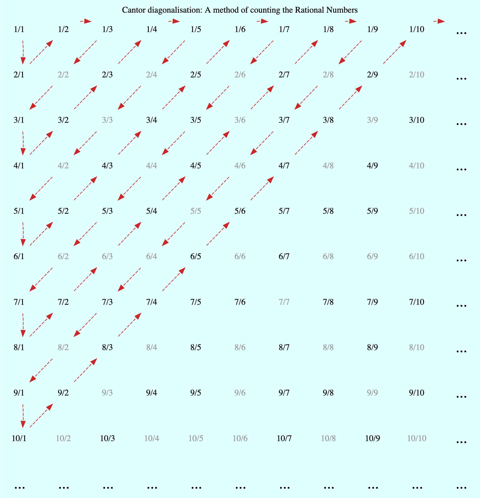
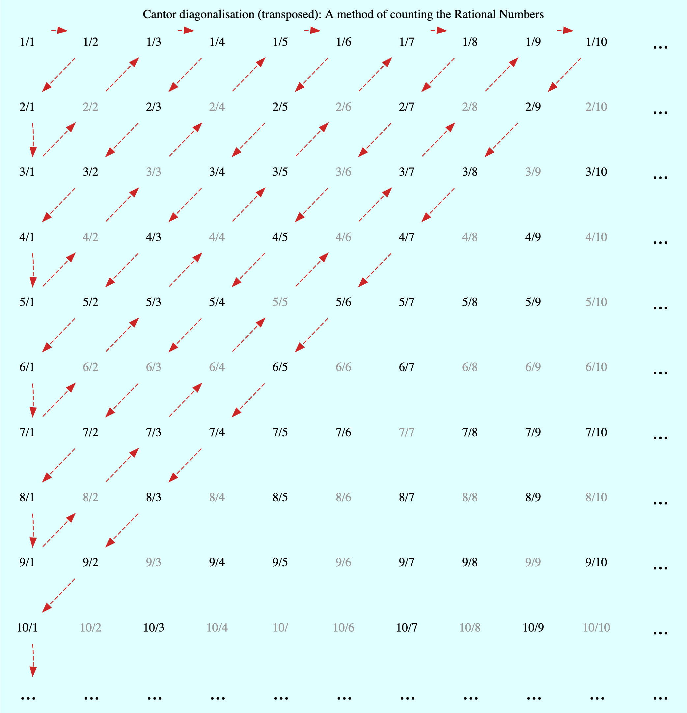
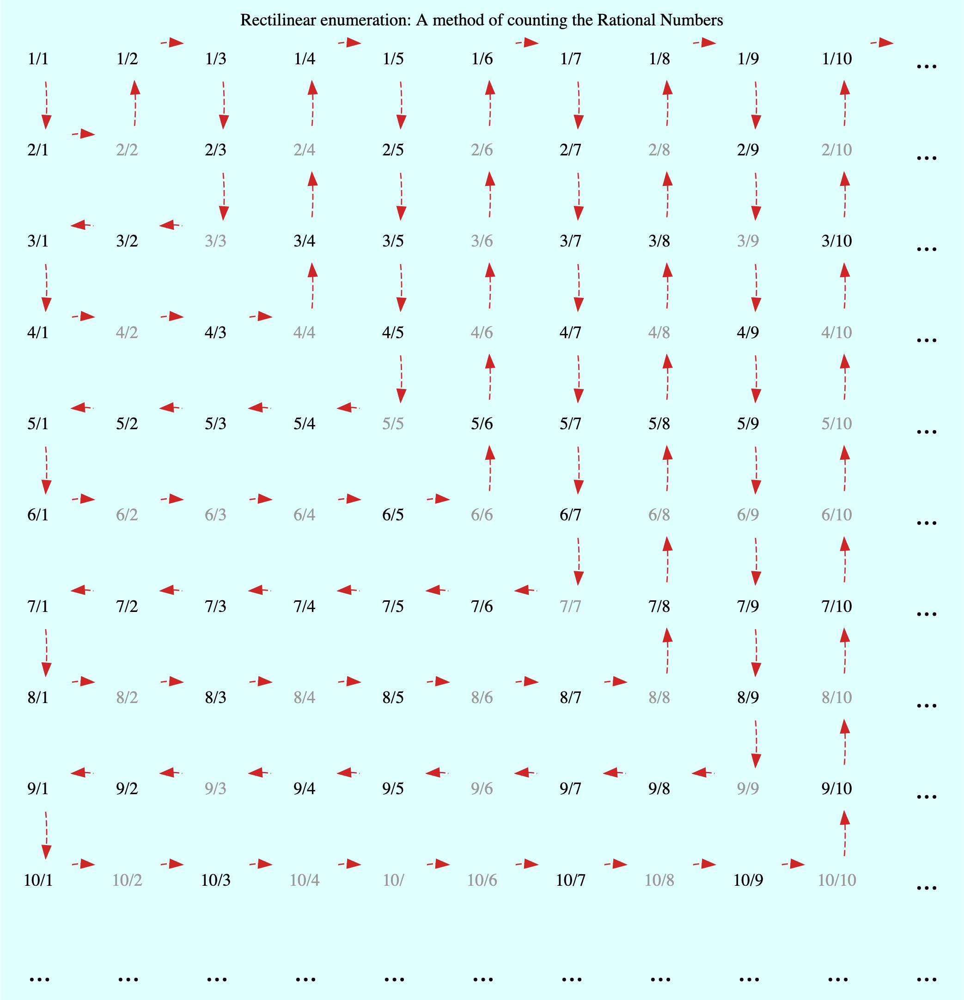
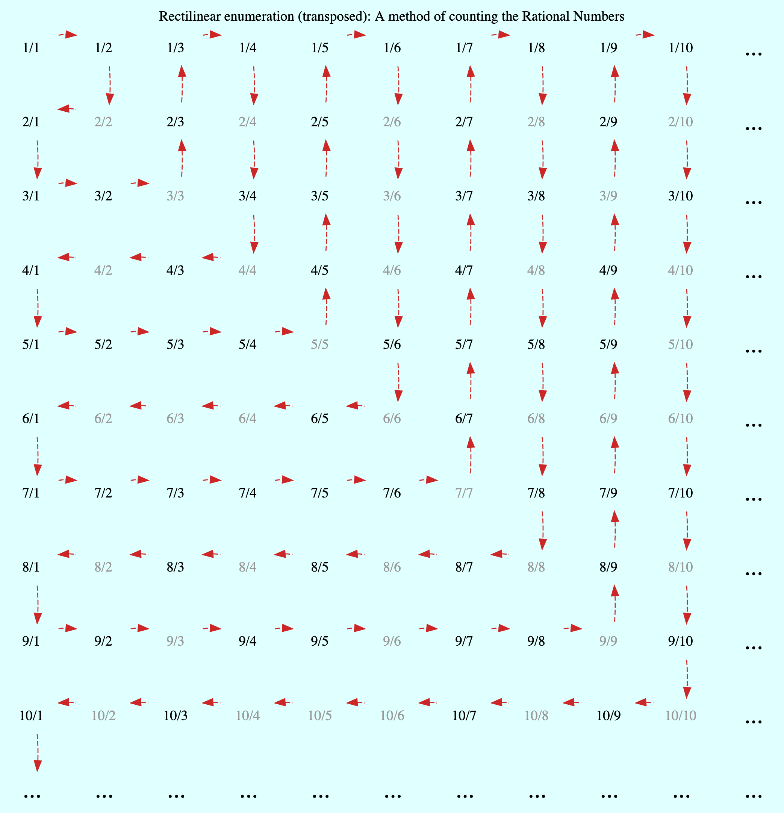
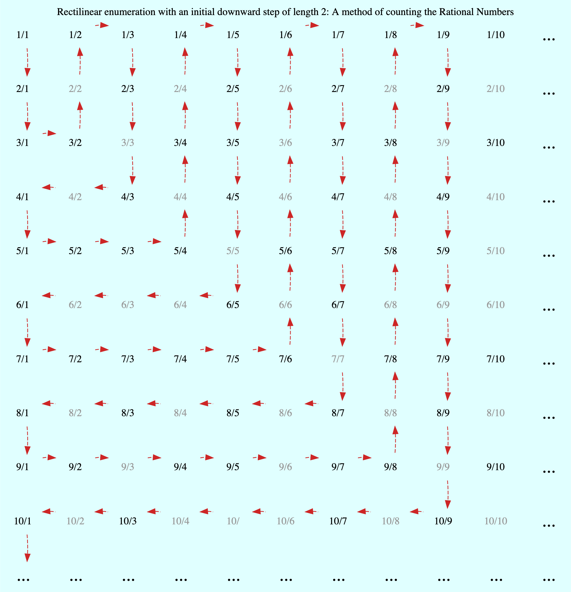
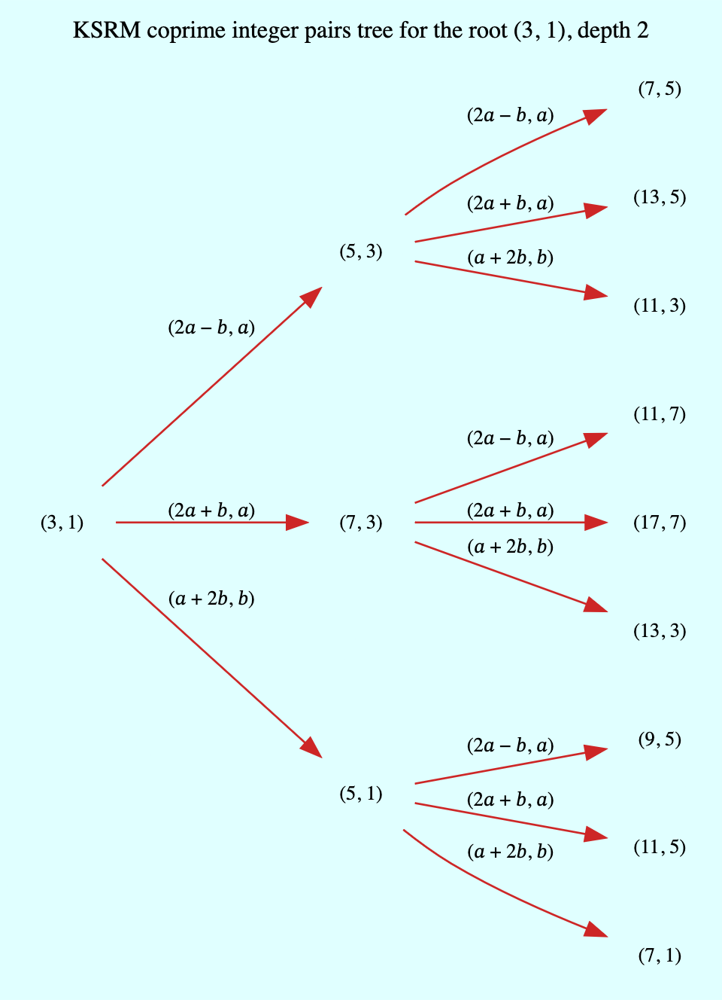

.. meta::

   :google-site-verification: 3F2Jbz15v4TUv5j0vDJAA-mSyHmYIJq0okBoro3-WMY

=========
Sequences
=========

The :doc:`sequences <continuedfractions/sequences>` library contains functions and classes relating to sequences and ordered structures of rational numbers, coprime integer pairs, and Farey sequences.

These are described below in some detail.

.. _sequences.rationals:

Counting Rational Numbers
=========================

The set of rational numbers, denoted by :math:`\mathbb{Q}`, is the set of all reduced integer fractions :math:`\pm\frac{a}{b}` (fractions with the greatest common divisors divided out), including :math:`0 = \frac{0}{1}`, and is infinite but countable (enumerable). The :doc:`sequences <continuedfractions/sequences>` library contains the :py:meth:`~continuedfractions.sequences.rationals` function for counting the rationals in different ways, as described in more detail below.

First, we note that to count the elements of any set involves putting all of them in a chosen order so that they occur without repetition. The larger the set the larger is the number of possible orderings (enumerations). As :math:`\mathbb{Q}` is countably infinite - its size or cardinality is denoted by :math:`\aleph_0` (pronounced "Aleph 0"), which is the same as that of the integers :math:`\mathbb{Z}` and the natural (counting) numbers :math:`\mathbb{N}` - there are infinitely many enumerations. A few of these, including some which are well-known and others perhaps less well-known, are described in some detail below. Also, note that, generally, in relation to enumeration, the negative rationals are ignored as they mirror the positive rationals, and all references to "rationals" are to the positive rationals (positive reduced integer fractions), unless otherwise stated. 

.. _sequences.rationals.cantor-diagonalisation:

Cantor Diagonalisation
----------------------

A well known way of counting the rationals is **Cantor diagonalisation** (or Cantor's diagonal method), which is graphically depicted below, with the red arrows indicating the counting direction:

This method is based on first representing all (positive) integer fractions on a two-dimensional grid, which we may call the **Cantor grid**. On this grid all fractions in the :math:`i`-th row have the numerator :math:`i`, while all the fractions in :math:`j`-th column have the denominator :math:`j`. All integer pairs :math:`(a, b)` can thus be represented as fractions on the grid, although not all the fractions need to be counted: the rationals correspond to the irreducible fractions, while the composite fractions, which appear in grey in the diagram, are omitted as they are reducible to the rationals.

The :py:func:`~continuedfractions.sequences.rationals` function can be used to perform this enumeration by specifying the ``enumeration="cantor diagonal"`` argument. Here is an example for the first 20 rationals in this enumeration:

.. code:: python

   >>> from continuedfractions.sequences import rationals
   >>> rats = rationals(enumeration="cantor diagonal")
   >>> for i, r in enumerate(rats, start=1):
   ...     print(r, end=', ')
   ...     if i == 19:
   ...         print(next(rats))
   ...         break
   ... 
   1, 2, 1/2, 1/3, 3, 4, 3/2, 2/3, 1/4, 1/5, 5, 6, 5/2, 4/3, 3/4, 2/5, 1/6, 1/7, 3/5, 5/3

By default the :py:func:`~continuedfractions.sequences.rationals` function generates only positive rational numbers (``positive_only=True``), and does so in the form of :py:class:`~continuedfractions.continuedfraction.ContinuedFraction` objects, e.g.:

.. code:: python

   >>> rats = rationals(enumeration="cantor diagonal")
   >>> first_twenty = [next(rats) for _ in range(20)]
   >>> first_twenty
   [ContinuedFraction(1, 1), ContinuedFraction(2, 1), ContinuedFraction(1, 2), ContinuedFraction(1, 3), ContinuedFraction(3, 1), ContinuedFraction(4, 1), ContinuedFraction(3, 2), ContinuedFraction(2, 3), ContinuedFraction(1, 4), ContinuedFraction(1, 5), ContinuedFraction(5, 1), ContinuedFraction(6, 1), ContinuedFraction(5, 2), ContinuedFraction(4, 3), ContinuedFraction(3, 4), ContinuedFraction(2, 5), ContinuedFraction(1, 6), ContinuedFraction(1, 7), ContinuedFraction(3, 5), ContinuedFraction(5, 3)]

To include negative rational numbers, as well as :math:`0`, the function should be called with the ``positive_only=False`` optional argument. For example:

.. code:: python

   >>> rats = rationals(enumeration="cantor diagonal", positive_only=False)
   >>> first_twenty_plus_zero = [next(rats) for _ in range(21)]
   >>> first_twenty_plus_zero
   [ContinuedFraction(0, 1), ContinuedFraction(1, 1), ContinuedFraction(-1, 1), ContinuedFraction(2, 1), ContinuedFraction(-2, 1), ContinuedFraction(1, 2), ContinuedFraction(-1, 2), ContinuedFraction(1, 3), ContinuedFraction(-1, 3), ContinuedFraction(3, 1), ContinuedFraction(-3, 1), ContinuedFraction(4, 1), ContinuedFraction(-4, 1), ContinuedFraction(3, 2), ContinuedFraction(-3, 2),
   ContinuedFraction(2, 3), ContinuedFraction(-2, 3), ContinuedFraction(1, 4), ContinuedFraction(-1, 4), ContinuedFraction(1, 5),
   ContinuedFraction(-1, 5)]

.. note::

   The function generates infinitely, so should be used carefully: to limit the generation conditions may be applied in the form of integer or float-valued upper bounds, or in terms of bounds on the number of terms that are generated. User-defined options for limiting or configuring the generation may be added as future enhancements.

   Also, printing :py:class:`~continuedfractions.continuedfraction.ContinuedFraction` objects to the console `produces <https://github.com/python/cpython/blob/3.13/Lib/fractions.py#L427>`_ strings of the form ``x`` or ``x/y`` where ``x`` and ``y`` are integers, because :py:class:`~continuedfractions.continuedfraction.ContinuedFraction` is a subclass of :py:class:`~fractions.Fraction`.

The Cantor diagonal enumeration can be understood in terms of the **diagonals** :math:`D_n` on the grid: the :math:`n`-th diagonal :math:`D_n` is the subsequence of length :math:`n` given by:

.. math::

   D_n := \left( \frac{n}{1},\frac{n - 1}{2},\frac{n - 2}{3},\ldots,\frac{1}{n} \right), \hskip{1em}n \geq 1

Note that in this sequence the numerators form a decreasing arithmetic sequence :math:`(n. n - 1, n - 2, \ldots, 1)` with common difference :math:`1`, and the denominators form an increasing arithmetic sequence :math:`(1, 2, 3, \ldots, n)` with common difference :math:`1`. Also, these diagonals include composite fractions, and we don't consider counting order until the enumeration starts. So we have the diagonals:

.. math::

   \begin{align}
   D_1 &= \left( \frac{1}{1} \right) \\
   D_2 &= \left( \frac{2}{1}, \frac{1}{2}, \right) \\
   D_3 &= \left( \frac{3}{1}, \frac{2}{2}, \frac{3}{1}, \right) \\
   D_4 &= \left( \frac{4}{1}, \frac{3}{2}, \frac{2}{3}, \frac{1}{4} \right) \\
   D_5 &= \left( \frac{5}{1}, \frac{4}{2}, \frac{3}{3}, \frac{2}{4}, \frac{1}{5} \right) \\
   \ldots
   \end{align}

The Cantor diagonal enumeration of the rationals is simply the enumeration on the diagonals given by the following rules:

* Count :math:`D_1` first.
* For :math:`n = 2,3,4,\ldots` in that order, count :math:`D_n` from left to right if :math:`n` is even, or from right to left if :math:`n` is odd.
* Omit composite fractions.

Another way to think of this enumeration is in terms of the **weight** :math:`w` of a fraction :math:`\frac{a}{b}` (not necessarily in reduced form) which can be defined as the positive integer:

.. math::

   w\left(\frac{a}{b}\right) = |a| +| b|

By definition the :math:`n`-th diagonal :math:`D_n` contains all fractions of weight :math:`n + 1`, and as :math:`\lim_{n \to \infty}` all fractions of all weights, and thus all rational numbers, are included in the enumeration.

There is a "transposed" version of this enumeration in which, after starting with :math:`D_1` as before, we reverse the rules described above: 

* Count :math:`D_1` first.
* For :math:`n = 1,2,3,\ldots` in that order, count :math:`D_n` from right to left if :math:`n` is even, or from left to right if :math:`n` is odd.
* Omit composite fractions.

This enumeration can be performed with the :py:func:`~continuedfractions.sequences.rationals` method function and the ``enumeration="cantor diagonal transposed"`` argument:

.. code:: python

   >>> rats = rationals(enumeration="cantor diagonal transposed")
   >>> for i, r in enumerate(rats, start=1):
   ...     print(r, end=', ')
   ...     if i == 19:
   ...         print(next(rats))
   ...         break
   ... 
   1, 1/2, 2, 3, 1/3, 1/4, 2/3, 3/2, 4, 5, 1/5, 1/6, 2/5, 3/4, 4/3, 5/2, 6, 7, 5/3, 3/5

The enumeration is graphically depicted below:

The resulting sequence can be obtained from the numbers in the first sequence by transposing the numerators and denominators.

.. _sequences.rationals.rectilinear:

Rectilinear Enumeration
-----------------------

There are some other interesting enumeration methods of rationals on the Cantor grid, including one, described here, which may be called **"rectilinear"**. This is graphically depicted below:

(As with Cantor diagonalisation, the composite fractions appear in grey, and are not counted.) This enumeration can be understood more clearly in terms of (finite) subsequences :math:`⅃_n` that appear as reverse-L shapes in the diagram: so :math:`⅃_n` is the subsequence given by:

.. math::

   ⅃_n := \left( \frac{n}{1},\frac{n}{2},\frac{n}{3},\ldots,\frac{n}{n},\frac{n - 1}{n},\frac{n - 2}{n},\frac{n - 3}{n},\ldots,\frac{1}{n}\right), \hskip{1em} n \geq 1

In the :math:`⅃_n`, as with the Cantor diagonals :math:`D_n` described above, we don't consider counting order until we actually start the enumeration. Here are the first five :math:`⅃_n`:

.. math::

   \begin{align}
   ⅃_1 &= \left( \frac{1}{1} \right) \\
   ⅃_2 &= \left( \frac{2}{1}, \frac{2}{2}, \frac{1}{2}, \right) \\
   ⅃_3 &= \left( \frac{3}{1}, \frac{3}{2}, \frac{3}{3}, \frac{2}{3}, \frac{1}{3} \right) \\
   ⅃_4 &= \left( \frac{4}{1}, \frac{4}{2}, \frac{4}{3}, \frac{4}{4}, \frac{3}{4}, \frac{2}{4}, \frac{1}{4} \right) \\
   ⅃_5 &= \left( \frac{5}{1}, \frac{5}{2}, \frac{5}{3}, \frac{5}{4}, \frac{5}{5}, \frac{4}{5}, \frac{3}{5}, \frac{2}{5}, \frac{1}{5} \right) \\
   \ldots
   \end{align}

Each :math:`⅃_n` is a subsequence of length :math:`2n - 1`, and we can decompose it into two smaller subsequences :math:`⅃_{n,1}` and :math:`⅃_{n,2}` given by:

.. math::

   \begin{align}
   ⅃_{n,1} &:= \left( \frac{n}{1},\frac{n}{2},\ldots,\frac{n}{n} \right) \\
   ⅃_{n,2} &:= \left( \frac{n - 1}{n},\frac{n - 2}{n},\ldots,\frac{1}{n} \right)
   \end{align}

These are the horizontal and vertical segments that make up :math:`⅃_n`, and have lengths :math:`n` and :math:`n - 1` respectively. The rectilinear enumeration of the rationals is simply an enumeration on the :math:`⅃_n` given by the following rules:

* Count :math:`⅃_1` first.
* For :math:`n = 2,3,4,\ldots` in that order, first count :math:`⅃_{n,1}` from left to right and then :math:`⅃_{n,2}` from bottom to top if :math:`n` is even, or, if :math:`n` is odd first count :math:`⅃_{n,2}` from top to bottom and then :math:`⅃_{n,1}` from right to left.
* Omit composite fractions.

This enumeration can be performed with the :py:func:`~continuedfractions.sequences.rationals` method function and the ``enumeration="rectilinear"`` argument:

.. code:: python

   >>> rats = rationals(enumeration="rectilinear")
   >>> for i, r in enumerate(rats, start=1):
   ...     print(r, end=', ')
   ...     if i == 19:
   ...         print(next(rats))
   ...         break
   ... 
   1, 2, 1/2, 1/3, 2/3, 3/2, 3, 4, 4/3, 3/4, 1/4, 1/5, 2/5, 3/5, 4/5, 5/4, 5/3, 5/2, 5, 6

An interesting property of the :math:`⅃_n` is that, for each :math:`n`, the sequence of weights :math:`w\left(⅃_n\right)` forms a **palindromic sequence** of length :math:`2n - 1` starting and finishing with the number :math:`n + 1`:

.. math::

   w \left(⅃_n\right) = \left(\overbrace{n + 1, n + 2, n + 3, \ldots,}^{\text{+ve arithmetic sequence}} 2n \underbrace{,2n - 1, 2n - 2, 2n - 3, \ldots, n + 1}_{\text{-ve arithmetic sequence}}\right)

As with the Cantor diagonal method, there is a transposed version of the rectilinear enumeration, where the same subsequences :math:`⅃_n` are involved but counted in reverse order and depending on whether :math:`n` is even or odd. This enumeration is graphically depicted below:

This enumeration is described by the following rules:

* Count :math:`⅃_1` first.
* For :math:`n = 2,3,4,\ldots` in that order, first count :math:`⅃_{n,2}` from top to bottom and then :math:`⅃_{n,1}` from right to left if :math:`n` is even, or, if :math:`n` is odd first count :math:`⅃_{n,1}` from left to right and then :math:`⅃_{n,2}` from bottom to top.
* Omit composite fractions.

The enumeration can be performed with the :py:func:`~continuedfractions.sequences.rationals` method function using the ``enumeration="rectilinear transposed"`` argument:

.. code:: python

   >>> rats = rationals(enumeration="rectilinear transposed")
   >>> for i, r in enumerate(rats, start=1):
   ...     print(r, end=', ')
   ...     if i == 20:
   ...         print(next(rats))
   ...         break
   ... 
   1, 1/2, 2, 3, 3/2, 2/3, 1/3, 1/4, 3/4, 4/3, 4, 5, 5/2, 5/3, 5/4, 4/5, 3/5, 2/5, 1/5, 1/6

.. _sequences.rationals.generalised-rectilinear:

Generalisations
~~~~~~~~~~~~~~~

Although not currently supported by the :py:meth:`~continuedfractions.sequences.rationals` function, the rectilinear enumeration can be generalised by varying the length of the "initial path" of the enumeration starting from :math:`\frac{1}{1}`. If we denote the length of this initial path by :math:`\lambda`, then :math:`\frac{1}{1}` was followed by either :math:`\frac{2}{1}` in the first kind of rectilinear enumeration that was described, or by :math:`\frac{1}{2}` in the rectilinear transposed enumeration, so that :math:`\lambda = 1`. For :math:`\lambda > 1` we can define the initial path as either:

.. math::

   \frac{1}{1} \rightarrow \frac{2}{1} \rightarrow \cdots \rightarrow \frac{\lambda + 1}{1}

for a downward path, or as:

.. math::

   \frac{1}{1} \rightarrow \frac{1}{2} \rightarrow \cdots \rightarrow \frac{1}{\lambda + 1}

for a right-ward path. If we choose :math:`\lambda = 2` and opt for a downward initial path then this initial path is :math:`\frac{1}{1} \rightarrow \frac{2}{1} \rightarrow \frac{3}{1}`, and we can enumerate using the rectilinear approach as follows:

For each :math:`\lambda = 1,2,3,\ldots` we get a slightly different, more "elongated" rectilinear enumeration, which also shows that these form a countably infinite (:math:`\aleph_0`) subset of the set of all enumerations of the rationals. There are also natural transposes of these enumerations,  similar to what has been described above for the rectilinear enumeration with :math:`\lambda = 1`.

.. _sequences.mediants:

Mediants
========

The (simple) **mediant** of two rational numbers :math:`\frac{a}{b}` and :math:`\frac{c}{d}`, where :math:`b, d, b + d \neq 0`, is defined as the rational number:

.. math::

   \frac{a + c}{b + d}

Given two :py:class:`~continuedfractions.continuedfraction.ContinuedFraction` instances it is possible to compute their mediant using the :py:meth:`~continuedfractions.continuedfraction.ContinuedFraction.mediant` method:

.. code::

   >>> ContinuedFraction(1, 2).mediant(ContinuedFraction(2, 3))
   ContinuedFraction(3, 5)

The result is also a :py:class:`~continuedfractions.continuedfraction.ContinuedFraction` instance.

.. _sequences.mediants.properties:

Properties
----------

Assuming that :math:`\frac{a}{b} < \frac{c}{d}` and :math:`bd > 0` (which implies both :math:`\frac{a}{b}` and :math:`\frac{c}{d}` have the same sign) the mediant above has the property that:

.. math::

   \frac{a}{b} < \frac{a + c}{b + d} < \frac{c}{d}

From the assumptions above this can be proved easily from the following relations:

.. math::

   \begin{align}
   \frac{a}{b} < \frac{c}{d} &\iff \frac{c}{a} > \frac{d}{b} \iff \frac{a}{c} < \frac{b}{d} \\
   \frac{a + c}{b + d} &= \frac{a}{b} \cdot \frac{1 + \frac{c}{a}}{1 + \frac{d}{b}} \\
                       &= \frac{c}{d} \cdot \frac{1 + \frac{a}{c}}{1 + \frac{b}{d}}
   \end{align}

Mediants can give good rational approximations to real numbers. We can illustrate the core mediant property with some examples.

.. code:: python

   >>> ContinuedFraction('0.5').right_mediant(Fraction(2, 3))
   ContinuedFraction(3, 5)
   >>> tuple(ContinuedFraction('0.6').coefficients)
   (0, 1, 1, 2)
   >>> ContinuedFraction(1, 2).mediant(ContinuedFraction('2/3'))
   ContinuedFraction(3, 5)
   >>> assert ContinuedFraction(1, 2) < ContinuedFraction(1, 2).mediant(Fraction(3, 4)) < ContinuedFraction(3, 4)
   # True

In particular, the mediant :math:`\frac{a + c}{b + d}` of :math:`\frac{a}{b}` and :math:`\frac{c}{d}` has the property that **if** :math:`bc - ad = 1` then :math:`\frac{a + c}{b + d}` is the fraction with the smallest denominator lying in the (open) interval :math:`(\frac{a}{b}, \frac{c}{d})`. As :math:`\frac{1}{2}` and :math:`\frac{2}{3}` satisfy the relation :math:`bc - ad = 2\cdot2 - 1\cdot3 = 4 - 3 = 1` it follows that their mediant :math:`\frac{3}{5}` is the "next" (or "first")  fraction after :math:`\frac{1}{2}`, but before :math:`\frac{2}{3}`, compared to any other fraction in that interval with a denominator :math:`\geq b + d = 5`. 

This is an ordering property that links mediants to ordered sequences of rational numbers such as `Farey sequences <https://en.wikipedia.org/wiki/Farey_sequence>`_, which are described in more detail :ref:`here <sequences.farey-sequences>`,
and also tree orderings such as the `Stern-Brocot tree <https://en.wikipedia.org/wiki/Stern%E2%80%93Brocot_tree>`_.

.. _sequences.mediants.generalised:

Left- and Right-Mediants
------------------------

The concept of the simple mediant of two fractions of :math:`\frac{a}{b}` and :math:`\frac{c}{d}` as given above can be generalised to :math:`k`-th **left-** and **right-mediants**: for a positive integer :math:`k` the :math:`k`-th left mediant of :math:`\frac{a}{b}` and :math:`\frac{c}{d}` can be defined as:

.. math::

   \frac{ka + c}{kb + d}, \hskip{3em} k \geq 1

while the :math:`k`-th right mediant can be defined as:

.. math::

   \frac{a + kc}{b + kd}, \hskip{3em} k \geq 1

For :math:`k = 1` the left- and right-mediants are identical to the simple mediant :math:`\frac{a + c}{b + d}`, but for :math:`k > 1` the :math:`k`-th left-mediant is less than the :math:`k`-th right mediant. Using the assumptions :math:`\frac{a}{b} < \frac{c}{d}` and :math:`bd > 0`, the proof is given by:

.. math::

   \begin{align}
   \frac{a + kc}{b + kd} - \left(\frac{ka + c}{kb + d}\right) &= \frac{(bc - ad)(k^2 - 1)}{(b + kd)(kb + d)} \\
                                                              &\geq 0
   \end{align}

where equality holds if and only if :math:`k = 1`.

Left- and right-mediants can be constructed easily using the :py:class:`~continuedfractions.continuedfraction.ContinuedFraction` class, which provides the :py:meth:`~continuedfractions.continuedfraction.ContinuedFraction.left_mediant` and :py:meth:`~continuedfractions.continuedfraction.ContinuedFraction.right_mediant` methods.

Here are some examples of constructing left-mediants:

.. code:: python

   >>> cf1 = ContinuedFraction('1/2')
   >>> cf2 = ContinuedFraction(3, 5)
   # The default `k = 1` gives you the common, simple mediant of the two rationals
   >>> cf1.left_mediant(cf2)
   ContinuedFraction(4, 7)
   >>> cf1.left_mediant(cf2, k=2)
   ContinuedFraction(5, 9)
   >>> cf1.left_mediant(cf2, k=100)
   ContinuedFraction(103, 205)
   >>> cf1.left_mediant(cf2, k=100).as_decimal()
   Decimal('0.5024390243902439024390243902439024390243902439024390243902439024390243902439024390243902439024390244')

and right-mediants:

.. code:: python

   >>> cf1 = ContinuedFraction('1/2')
   >>> cf2 = ContinuedFraction(3, 5)
   # The default `k = 1` gives you the common, simple mediant of the two rationals
   >>> cf1.right_mediant(cf2)
   ContinuedFraction(4, 7)
   >>> cf1.right_mediant(cf2, k=2)
   ContinuedFraction(7, 12)
   >>> cf1.right_mediant(cf2, k=100)
   ContinuedFraction(301, 502)
   >>> cf1.right_mediant(cf2, k=100).as_decimal()
   Decimal('0.5996015936254980079681274900')

As :math:`k \longrightarrow \infty` the sequences of left- and right-mediants separate into two, strictly monotonic, sequences 
converging to opposite limits: the left-mediants form a strictly decreasing sequence lower-bounded by :math:`\frac{a}{b}`:

.. math::

   \frac{a}{b} < \cdots < \frac{3a + c}{3b + d} < \frac{2a + c}{2b + d} < \frac{a + c}{b + d} < \frac{c}{d}

thus converging to :math:`\frac{a}{b}`:

.. math::

   \lim_{k \to \infty} \frac{ka + c}{kb + d} = \lim_{k \to \infty} \frac{a + \frac{c}{k}}{b + \frac{d}{k}} = \frac{a}{b}

while the right-mediants form a strictly increasing sequence upper-bounded by :math:`\frac{c}{d}`:

.. math::

   \frac{a}{b} < \frac{a + c}{b + d} < \frac{a + 2c}{b + 2d} < \frac{a + 3c}{b + 3d} < \cdots < \frac{c}{d}

thus converging to :math:`\frac{c}{d}`:

.. math::

   \lim_{k \to \infty} \frac{a + kc}{b + kd} = \lim_{k \to \infty} \frac{\frac{a}{k} + c}{\frac{b}{k} + d} = \frac{c}{d}

We can see this with the ``ContinuedFraction(1, 2)`` and ``ContinuedFraction(3, 5)`` instances used in the examples above, starting with the left-mediants:

.. code:: python

   >>> cf1 = ContinuedFraction(1, 2)
   >>> cf2 = ContinuedFraction(3, 5)
   >>> cf1.left_mediant(cf2)
   ContinuedFraction(4, 7)
   >>> cf1.left_mediant(cf2).as_decimal()
   Decimal('0.5714285714285714285714285714')
   >>> cf1.left_mediant(cf2, k=10).as_decimal()
   Decimal('0.52')
   >>> cf1.left_mediant(cf2, k=100).as_decimal()
   Decimal('0.5024390243902439024390243902439024390243902439024390243902439024390243902439024390243902439024390244')
   >>> cf1.left_mediant(cf2, k=10 ** 6)
   ContinuedFraction(1000003, 2000005)
   >>> cf1.left_mediant(cf2, k=10 ** 6).as_decimal()
   Decimal('0.5000002499993750015624960938')

And then the right-mediants:

.. code:: python

   >>> cf1 = ContinuedFraction(1, 2)
   >>> cf2 = ContinuedFraction(3, 5)
   >>> cf1.right_mediant(cf2).as_decimal()
   Decimal('0.5714285714285714285714285714')
   >>> cf1.right_mediant(cf2, k=10).as_decimal()
   Decimal('0.5961538461538461538461538462')
   >>> cf1.right_mediant(cf2, k=100).as_decimal()
   Decimal('0.5996015936254980079681274900')
   >>> cf1.right_mediant(cf2, k=10 ** 6)
   ContinuedFraction(3000001, 5000002)
   >>> cf1.right_mediant(cf2, k=10 ** 6).as_decimal()
   Decimal('0.5999999600000159999936000026')

A particular class of right-mediants are known as `semiconvergents <https://en.wikipedia.org/wiki/Continued_fraction#Semiconvergents>`_, and are described in more detail :ref:`here <continued-fractions.semiconvergents>`.

.. _sequences.coprime-integers:

Coprime Integers
================

Two integers :math:`a, b` are said to be **coprime** (or **relatively prime**) if their `greatest common divisor (GCD) <https://en.wikipedia.org/wiki/Greatest_common_divisor>`_ is :math:`1` - this is also written as :math:`(a, b) = 1`. This occurs if and only :math:`a` has no prime factors in common with :math:`b`.

The notion of coprimality can be extended to finite sets of integers: a finite set of integers :math:`S = \{a, b, c, \ldots\}` can be called coprime if the GCD of all the integers in :math:`S` is :math:`1`. A stronger condition is met by :math:`S` if it is **pairwise coprime**, which means the GCD of any two integers in :math:`S` is :math:`1`. The latter implies the former, but the converse does not necessarily hold.

Coprimality is important in several basic ways for the sequences that can be generated with the :doc:`sequences <continuedfractions/sequences>` library, and in this section, some effective methods for generating coprime integer pairs are described, with code examples.

.. _sequences.simple-approach:

A Simple Approach
-----------------

The :py:func:`~continuedfractions.sequences.coprime_pairs` function is a simple but relatively fast generator of pairs of coprime integers bounded by a given integer :math:`n \geq 1`. Here's an example for :math:`n = 5`:

.. code:: python

   >>> tuple(coprime_integers(5))
   (1, 1), (2, 1), (3, 1), (3, 2), (4, 1), (4, 3), (5, 1), (5, 2), (5, 3), (5, 4)

It can be verified that the number of coprime pairs returned by the function here, namely, :math:`10`, is indeed equal to :math:`\phi(1) + \phi(2) + \phi(3) + \phi(4) + \phi(5) = 10`, where :math:`\phi(n)` is Euler's totient function that counts the number of (positive) integers coprime to a given integer :math:`n \geq 1`, and :math:`\phi(1) = 1`. The function that counts the value of :math:`\sum_{k=1}^n \phi(k)` for a given :math:`n` is the summatory totient function :math:`\Phi(n)`, and the number of coprime pairs returned by :py:func:`~continuedfractions.sequences.coprime_pairs` is equal to :math:`\Phi(n)`. Here are a few examples for :math:`n = 1,\ldots,5`:

.. code:: python

   >>> sum(1 for _ in coprime_integers(1))
   1
   >>> sum(1 for _ in coprime_integers(2))
   2
   >>> sum(1 for _ in coprime_integers(3))
   4
   >>> sum(1 for _ in coprime_integers(4))
   6
   >>> sum(1 for _ in coprime_integers(5))
   10
   >>> sum(1 for _ in coprime_integers(10))
   32

.. _sequences.ksrm-trees:

KSRM Trees
----------

Coprime integer pairs can also be generated from trees, and a particularly interesting tree-based generative approach is described below.

The :py:class:`~continuedfractions.sequences.KSRMTree` class is a class implementation of two ternary trees for representing (and generating) all pairs of (positive) coprime integers, as presented in separate papers by A. R. Kanga, and `R. Saunders and T. Randall <https://doi.org/10.2307/3618576>`_, and `D. W. Mitchell <https://doi.org/10.2307/3622017>`_.

.. note::

   The class is named ``KSRMTree`` purely for convenience, but it is actually a representation of two (ternary) trees.

Firstly, we describe some background material on the KSRM trees, which are presented in the papers mentioned above. These are concerned with primitive Pythagorean triples, but have a fundamental consequence for the representation (and generation) of coprime pairs: all pairs of (positive) coprime integers :math:`(a, b)`, where :math:`1 \leq b < a`, can be represented as nodes in one of two ternary trees, the first which has the "parent" node :math:`(2, 1)` and the second which has the parent node :math:`(3, 1)`. Each node, starting with the parent nodes, has three children given by the relations:

.. math::

   (a^\prime, b^\prime) = \begin{cases}
                          (2a - b, a), \hskip{3em} \text{ branch #} 1 \\
                          (2a + b, a), \hskip{3em} \text{ branch #} 2 \\
                          (a + 2b, b), \hskip{3em} \text{ branch #} 3                   
                          \end{cases}

all of which are coprime. The children of these nodes by the same branch relations are also coprime, and so on. For the original proofs please refer to the papers.

We can inspect the roots and branches by constructing a :py:class:`~continuedfractions.sequences.KSRMTree` instance, and looking at the :py:attr:`~continuedfractions.sequences.KSRMTree.roots` and :py:attr:`~continuedfractions.sequences.KSRMTree.branches` properties.

.. code:: python
    
   >>> tree = KSRMTree()
   >>> tree.roots
   ((2, 1), (3, 1))
   >>> tree.branches
   (NamedCallableProxy("KSRM tree branch #1: (x, y) |--> (2x - y, x)"),
    NamedCallableProxy("KSRM tree branch #2: (x, y) |--> (2x + y, x)"),
    NamedCallableProxy("KSRM tree branch #3: (x, y) |--> (x + 2y, y)"))

The :py:attr:`~continuedfractions.sequences.KSRMTree.branches` property is a tuple of callables (instances of :py:class:`~continuedfractions.utils.NamedCallableProxy`), one for each of the three branches. Each callable takes two (coprime) integers :math:`a, b`, with :math:`1 \leq b < a`, as arguments. The nodes can be generated manually as follows:

.. code:: python

   # Generating the 1st generation of children for the root ``(2, 1)``
   >>> [tree.branches[k](2, 1) for k in range(3)]
   [(3, 2), (5, 2), (4, 1)]
   # Generating the 1st generation of children for the root ``(3, 1)``
   >>> [tree.branches[k](3, 1) for k in range(3)]
   [(5, 3), (7, 3), (5, 1)]

The generation of coprime pairs via the trees can then be implemented with a generative search procedure that starts separately from the parents :math:`(2, 1)` and :math:`(3, 1)`, and applies the functions given by the mappings below to each parent:

.. math::

   (a, b) &\longmapsto \begin{cases}
                       (2a - b, a), \hskip{3em} \text{ branch #} 1 \\
                       (2a + b, a), \hskip{3em} \text{ branch #} 2 \\
                       (a + 2b, b), \hskip{3em} \text{ branch #} 3
                       \end{cases}

producing the "1st generation" of :math:`3 + 3 = 6` pairs. This can be repeated ad infinitum as required.

.. note::

   The tree with the root :math:`(3, 1)` only contains coprime pairs of odd integers, under the maps described above.

If we let :math:`k = 0` denote the :math:`0`-th generation consisting only of the two roots :math:`(2, 1)` and :math:`(3, 1)`, then for :math:`k \geq 1` the :math:`k`-th generation, for either tree, will have a total of :math:`3^k` children, the total number of all members up to and including the :math:`k`-th generation will be :math:`1 + 3 + 3^2 + \ldots + 3^k = \frac{3^{k + 1} - 1}{2}`, and the total number of all members in both trees up to and including the :math:`k`-th generation will be :math:`3^{k + 1} - 1`.

For :math:`k = 2` (two generations) here are the trees, starting with the root :math:`(2, 1)`:

and then the root :math:`(3, 1)`:

The :py:class:`~continuedfractions.sequences.KSRMTree` class contains one main search method :py:meth:`~continuedfractions.sequences.KSRMTree.search`, which is a wrapper and generator that implements the procedure described above.

.. code:: python

   >>> tree = KSRMTree()
   >>> list(tree.search(1))
   [(1, 1)]
   >>> list(tree.search(2))
   [(1, 1), (2, 1)]
   >>> list(tree.search(3))
   [(1, 1), (2, 1), (3, 2), (3, 1)]
   >>> list(tree.search(5))
   [(1, 1), (2, 1), (3, 2), (4, 3), (4, 1), (3, 1), (5, 4), (5, 3), (5, 2), (5, 1)]
   >>> list(tree.search(10))
   [(1, 1), (2, 1), (3, 2), (4, 3), (5, 4), (6, 5), (7, 6), (8, 7), (9, 8), (8, 3), (7, 2), (5, 2), (8, 5), (9, 2), (4, 1), (7, 4), (9, 4), (6, 1), (8, 1), (3, 1), (5, 3), (7, 5), (9, 7), (7, 3), (5, 1), (9, 5), (7, 1), (9, 1), (10, 9), (10, 7), (10, 3), (10, 1)]

The number of coprime pairs generated for a given :math:`n \geq 1` is given by :math:`\Phi(n) = \sum_{k = 1}^n \phi(k)`.

The :py:meth:`~continuedfractions.sequences.KSRMTree.search` method is only a wrapper for the actual search function on roots, which is :py:meth:`~continuedfractions.sequences.KSRMTree.search_root`. This is also a generator, and implements a branch and bound, depth first search (DFS) of the KSRM trees, with pre-ordered traversal of nodes (current node -> left branch -> mid branch -> right branch), and backtracking and pruning on visited nodes. The backtracking function is implemented as the private method :py:meth:`~continuedfractions.sequences.KSRMTree._backtrack`.

Some examples are given below.

.. code:: python

   >>> tree = KSRMTree()
   >>> list(tree.search_root(5, (2, 1)))
   [(2, 1), (3, 2), (4, 3), (5, 4), (5, 2), (4, 1)]
   >>> assert tree.roots[0] == (2, 1)
   >>> list(tree.search_root(5, tree.roots[0]))
   [(2, 1), (3, 2), (4, 3), (5, 4), (5, 2), (4, 1)]
   >>> list(tree.search_root(5, (3, 1)))
   [(3, 1), (5, 3), (5, 1)]
   >>> assert tree.roots[1] == (3, 1)
   >>> list(tree.search_root(5, tree.roots[1]))
   [(3, 1), (5, 3), (5, 1)]

The result for a given :math:`n \geq 1` is a generator of coprime pairs, yielded in order of traversal, starting from the (given) root node. The tree is only traversed for :math:`n > 1`. More details on the implementation, including the depth-first search, branch-and-bound, pruning and backtracking and so on can be found in the :py:meth:`~continuedfractions.sequences.KSRMTree.search_root` API documentation.

The implementation of :py:meth:`~continuedfractions.sequences.KSRMTree.search_root` is guaranteed to terminate for any given :math:`n`, as there is always a finite subset of nodes :math:`(a, b)` satisfying the conditions :math:`1 \leq b < a \leq n` and :math:`(a, b) = 1`, and nodes that don't satisfy these conditions are discarded (pruned).

As the KSRM trees are infinite ternary trees the worst-case time and space complexity of a standard DFS, for a given :math:`n`, on either tree, are determined by the (variable) search depth :math:`d`, and the (constant) branching factor of :math:`3`. For space complexity the combination of backtracking and pruning "failed" nodes in the search ensures that for any given :math:`n` the smallest fraction of nodes are stored in memory at any given time - see the :py:meth:`~continuedfractions.sequences.KSRMTree._backtrack` and :py:meth:`~continuedfractions.sequences.KSRMTree.search_root` methods for more details.

.. _sequences.farey-sequences:

Farey Sequences
===============

The :py:func:`~continuedfractions.sequences.farey_sequence` function can be used to generate `Farey sequences <https://en.wikipedia.org/wiki/Farey_sequence>`_:

.. code:: python

   >>> from continuedfractions.sequences import farey_sequence
   >>> tuple(farey_sequence(10))
   (FareyFraction(0, 1), FareyFraction(1, 10), FareyFraction(1, 9), FareyFraction(1, 8), FareyFraction(1, 7), FareyFraction(1, 6), FareyFraction(1, 5), FareyFraction(2, 9), FareyFraction(1, 4), FareyFraction(2, 7), FareyFraction(3, 10), FareyFraction(1, 3), FareyFraction(3, 8), FareyFraction(2, 5), FareyFraction(3, 7), FareyFraction(4, 9), FareyFraction(1, 2), FareyFraction(5, 9), FareyFraction(4, 7), FareyFraction(3, 5), FareyFraction(5, 8), FareyFraction(2, 3), FareyFraction(7, 10), FareyFraction(5, 7), FareyFraction(3, 4), FareyFraction(7, 9), FareyFraction(4, 5), FareyFraction(5, 6), FareyFraction(6, 7), FareyFraction(7, 8), FareyFraction(8, 9), FareyFraction(9, 10), FareyFraction(1, 1))

The result is a tuple of :py:class:`~continuedfractions.sequences.FareyFraction` instances (just a plain subclass of :py:class:`~continuedfractions.continuedfraction.ContinuedFraction`) in ascending order of magnitude, starting with ``FareyFraction(0, 1)`` and ending with ``FareyFraction(1, 1)``.

The Farey sequence :math:`F_n` of order :math:`n` is an (ordered) sequence of (irreducible) rational numbers, called **Farey fractions**, in the closed unit interval :math:`[0, 1]`, which can be defined as follows:

.. math::

   \begin{align}
   F_n = \left(\frac{b}{a}\right) \text{ s.t. } & 1 \leq b < a \leq n,\\
                                                & \text{ or } b = 0, a = 1, \\
                                                & \text{ or } b = a = 1
   \end{align}

The special case is when :math:`n = 1` and :math:`F_1` is given by:

.. math::

   F_1 = \left(\frac{0}{1}, \frac{1}{1}\right)

For :math:`n \geq 2` the requirement that :math:`1 \leq b < a \leq n` means the fractions :math:`\frac{b}{a} \neq \frac{0}{1}, \frac{1}{1}` must be irreducible, which implies coprimality :math:`(a, b) = 1`.

The elements of :math:`F_n` are written in ascending order of magnitude. The first five Farey sequences are listed below:

.. math::

   \begin{align}
   F_1 &= \left( \frac{0}{1}, \frac{1}{1} \right) \\
   F_2 &= \left( \frac{0}{1}, \frac{1}{2}, \frac{1}{1} \right) \\
   F_3 &= \left( \frac{0}{1}, \frac{1}{3}, \frac{1}{2}, \frac{2}{3}, \frac{1}{1} \right) \\
   F_4 &= \left( \frac{0}{1}, \frac{1}{4}, \frac{1}{3}, \frac{1}{2}, \frac{2}{3}, \frac{3}{4}, \frac{1}{1} \right) \\
   F_5 &= \left( \frac{0}{1}, \frac{1}{5}, \frac{1}{4}, \frac{1}{3}, \frac{2}{5}, \frac{1}{2}, \frac{3}{5}, \frac{2}{3}, \frac{3}{4}, \frac{4}{5}, \frac{1}{1} \right)
   \end{align}

and this can be checked with the :py:func:`~continuedfractions.sequences.farey_sequence` function:

.. code:: python

   >>> tuple(farey_sequence(1))
   (FareyFraction(0, 1), FareyFraction(1, 1))
   >>> tuple(farey_sequence(2))
   (FareyFraction(0, 1), FareyFraction(1, 2), FareyFraction(1, 1))
   >>> tuple(farey_sequence(3))
   (FareyFraction(0, 1), FareyFraction(1, 3), FareyFraction(1, 2), FareyFraction(2, 3), FareyFraction(1, 1))
   >>> tuple(farey_sequence(4))
   (FareyFraction(0, 1), FareyFraction(1, 4), FareyFraction(1, 3), FareyFraction(1, 2), FareyFraction(2, 3), FareyFraction(3, 4), FareyFraction(1, 1))
   >>> tuple(farey_sequence(5))
   (FareyFraction(0, 1), FareyFraction(1, 5), FareyFraction(1, 4), FareyFraction(1, 3), FareyFraction(2, 5), FareyFraction(1, 2), FareyFraction(3, 5), FareyFraction(2, 3), FareyFraction(3, 4), FareyFraction(4, 5), FareyFraction(1, 1))

For :math:`n > 1` we can write the fractions in :math:`F_n` as :math:`\frac{b}{a}` where :math:`a > b`: the coprimality condition :math:`(a, b) = 1`, combined with :math:`a \leq n`, means that :math:`F_n` contains, for each :math:`a \leq n`, exactly :math:`\phi(a)` fractions of the form :math:`\frac{b}{a}` where :math:`a > b` and :math:`(a, b) = 1`, and :math:`\phi(k)` is the totient function.

As :math:`F_n` also contains the special fraction :math:`\frac{0}{1}` as its initial element, it means that the length :math:`|F_n|` of :math:`F_n` is given by:

.. math::

   |F_n| = 1 + \phi(1) + \phi(2) + \cdots + \phi(n) = 1 + \Phi(n)

For :math:`n > 1` the sequence :math:`F_n` contains all elements of :math:`F_{n - 1}`. Thus, the length :math:`|F_n|` can also be written as:

.. math::

   |F_n| = |F_{n - 1}| + \phi(n)

.. note::

   For any :math:`n \geq 1` the fraction :math:`\frac{1}{n}` first occurs as a Farey fraction in the Farey sequence :math:`F_n`. Also, the fraction :math:`\frac{1}{2}` is the middle term in any Farey sequence :math:`F_n` where :math:`n \geq 2`.

As with :py:func:`~continuedfractions.sequences.coprime_pairs` the counts for :py:func:`~continuedfractions.sequences.farey_sequence`, which uses the former, can be checked using the summatory totient function:

.. code:: python

   >>> assert len(tuple(farey_sequence(1))) == 1 + sum(map(sympy.totient, range(1, 2))) == 2
   >>> assert len(tuple(farey_sequence(2))) == 1 + sum(map(sympy.totient, range(1, 3))) == 3
   >>> assert len(tuple(farey_sequence(3))) == 1 + sum(map(sympy.totient, range(1, 4))) == 5
   >>> assert len(tuple(farey_sequence(4))) == 1 + sum(map(sympy.totient, range(1, 5))) == 7
   >>> assert len(tuple(farey_sequence(5))) == 1 + sum(map(sympy.totient, range(1, 6))) == 11
   >>> assert len(tuple(farey_sequence(10))) == 1 + sum(map(sympy.totient, range(1, 11))) == 33
   >>> assert len(tuple(farey_sequence(100))) == 1 + sum(map(sympy.totient, range(1, 101))) == 3045
   >>> assert len(tuple(farey_sequence(1000))) == 1 + sum(map(sympy.totient, range(1, 1001))) == 304193

Farey sequences have some interesting properties and connections with mediants and continued fractions, as described `here <https://en.wikipedia.org/wiki/Farey_sequence>`_. In relation to :ref:`mediants <sequences.mediants>` there is the notion of `Farey neighbours <https://en.wikipedia.org/wiki/Farey_sequence#Farey_neighbours>`_, which are simply adjacent or consecutive Farey fractions in a Farey sequence :math:`F_n`. Specifically, if fractions :math:`\frac{a}{b}` and :math:`\frac{c}{d}`, with :math:`\frac{a}{b} < \frac{c}{d}`, are Farey neighbours in a Farey sequence :math:`F_n`, where we may assume that :math:`n` is the smallest such index, then:

* the mediant :math:`\frac{a + c}{b + d}` is a Farey fraction which first appears in the Farey sequence :math:`F_{b + d}`.
* the difference :math:`\frac{c}{d} - \frac{a}{b} = \frac{bc - ad}{bd} = \frac{1}{bd}` is a Farey fraction which first appears in the Farey sequence :math:`F_{bd}`.

This can be checked using :py:func:`~continuedfractions.sequences.farey_sequence`, taking :math:`\frac{a}{b} = \frac{2}{3}` and :math:`\frac{c}{d} = \frac{3}{4}`, which first occur as Farey neighbours in the Farey sequence :math:`F_4`:

.. code:: python

   >>> print(', '.join(map(str, farey_sequence(4))))
   0, 1/4, 1/3, 1/2, 2/3, 3/4, 1
   >>> print(', '.join(map(str, farey_sequence(7))))
   0, 1/7, 1/6, 1/5, 1/4, 2/7, 1/3, 2/5, 3/7, 1/2, 4/7, 3/5, 2/3, 5/7, 3/4, 4/5, 5/6, 6/7, 1
   >>> FareyFraction(2, 3).mediant(FareyFraction(3, 4))
   FareyFraction(5, 7)
   >>> assert FareyFraction(2, 3).mediant(FareyFraction(3, 4)) in farey_sequence(7)
   >>> FareyFraction(3, 4) - FareyFraction(2, 3)
   FareyFraction(1, 12)
   >>> print(', '.join(map(str, farey_sequence(12))))
   0, 1/12, 1/11, 1/10, 1/9, 1/8, 1/7, 1/6, 2/11, 1/5, 2/9, 1/4, 3/11, 2/7, 3/10, 1/3, 4/11, 3/8, 2/5, 5/12, 3/7, 4/9, 5/11, 1/2, 6/11, 5/9, 4/7, 7/12, 3/5, 5/8, 7/11, 2/3, 7/10, 5/7, 8/11, 3/4, 7/9, 4/5, 9/11, 5/6, 6/7, 7/8, 8/9, 9/10, 10/11, 11/12, 1
   >>> assert FareyFraction(3, 4) - FareyFraction(2, 3) in farey_sequence(12)

.. _sequences.references:

References
==========

[1] Courant, R., Robbins, H., & Stewart, I. (1996). What is mathematics?: An elementary approach to ideas and methods (2nd ed.). Oxford University Press

[2] Hatcher, A. (2024, September). Topology of Numbers. American Mathematical Society. https://pi.math.cornell.edu/~hatcher/TN/TNbook.pdf

[3] Kanga, A. R. (1990). The Family Tree of Pythagorean Triplets. The Mathematical Gazette, 26(15), 15-17.

[4] Mitchell, D. W. (2001). An Alternative Characterisation of All Primitive Pythagorean Triples. The Mathematical Gazette, 85(503), 273-275. https://doi.org/10.2307/3622017

[5] Saunders, R., & Randall, T. (1994). The family tree of the Pythagorean triplets revisited. The Mathematical Gazette, 78(482), 190-193. https://doi.org/10.2307/3618576
