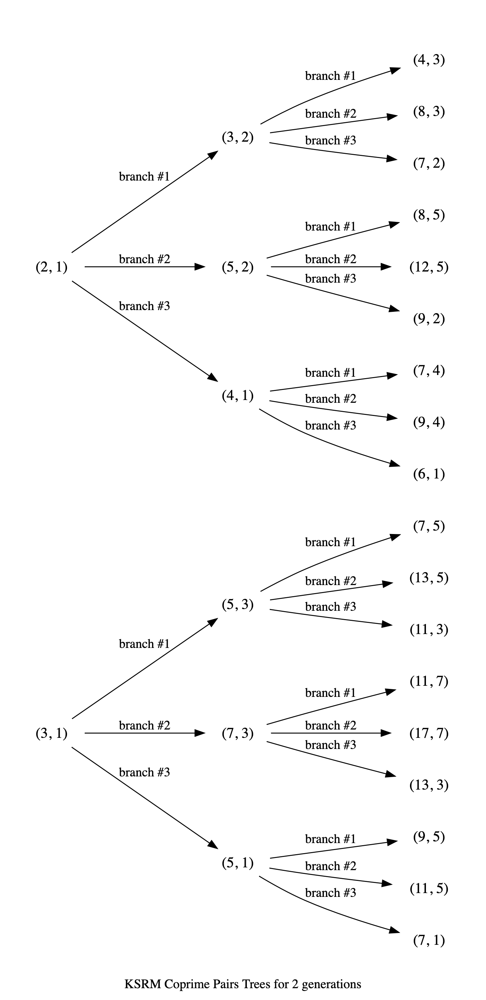

.. meta::

   :google-site-verification: 3F2Jbz15v4TUv5j0vDJAA-mSyHmYIJq0okBoro3-WMY

=========
Sequences
=========

The :doc:`sequences <sequences>` library contains functions and classes relating to ordered sequences and structures of integers and rational numbers, connected with continued fractions, such as `mediants <https://en.wikipedia.org/wiki/Mediant_(mathematics)>`_, sequences of `coprime integers <https://en.wikipedia.org/wiki/Coprime_integers>`_, and `Farey sequences <https://en.wikipedia.org/wiki/Farey_sequence>`_.

These are described below in some detail.

.. _sequences.mediants:

Mediants
========

The (simple) **mediant** of two rational numbers :math:`\frac{a}{b}` and :math:`\frac{c}{d}`, where :math:`b, d, b + d \neq 0`, is defined as the rational number:

.. math::

   \frac{a + c}{b + d}

Given two :py:class:`~continuedfractions.continuedfraction.ContinuedFraction` instances it is possible to compute their mediant using the :py:meth:`~continuedfractions.continuedfraction.ContinuedFraction.mediant` method:

.. code::

   >>> ContinuedFraction(1, 2).mediant(ContinuedFraction(2, 3))
   ContinuedFraction(3, 5)

The result is also a :py:class:`~continuedfractions.continuedfraction.ContinuedFraction` instance.

.. _sequences.mediants.properties:

Properties
----------

Assuming that :math:`\frac{a}{b} < \frac{c}{d}` and :math:`bd > 0` (which implies both :math:`\frac{a}{b}` and :math:`\frac{c}{d}` have the same sign) the mediant above has the property that:

.. math::

   \frac{a}{b} < \frac{a + c}{b + d} < \frac{c}{d}

From the assumptions above this can be proved easily from the following relations:

.. math::

   \begin{align}
   \frac{a}{b} < \frac{c}{d} &\iff \frac{c}{a} > \frac{d}{b} \iff \frac{a}{c} < \frac{b}{d} \\
   \frac{a + c}{b + d} &= \frac{a}{b} \cdot \frac{1 + \frac{c}{a}}{1 + \frac{d}{b}} \\
                       &= \frac{c}{d} \cdot \frac{1 + \frac{a}{c}}{1 + \frac{b}{d}}
   \end{align}

Mediants can give good rational approximations to real numbers. We can illustrate the core mediant property with some examples.

.. code:: python

   >>> ContinuedFraction('0.5').right_mediant(Fraction(2, 3))
   ContinuedFraction(3, 5)
   >>> ContinuedFraction('0.6').elements
   (0, 1, 1, 2)
   >>> ContinuedFraction(1, 2).mediant(ContinuedFraction('2/3'))
   ContinuedFraction(3, 5)
   >>> assert ContinuedFraction(1, 2) < ContinuedFraction(1, 2).mediant(Fraction(3, 4)) < ContinuedFraction(3, 4)
   # True

In particular, the mediant :math:`\frac{a + c}{b + d}` of :math:`\frac{a}{b}` and :math:`\frac{c}{d}` has the property that **if** :math:`bc - ad = 1` then :math:`\frac{a + c}{b + d}` is the fraction with the smallest denominator lying in the (open) interval :math:`(\frac{a}{b}, \frac{c}{d})`. As :math:`\frac{1}{2}` and :math:`\frac{2}{3}` satisfy the relation :math:`bc - ad = 2\cdot2 - 1\cdot3 = 4 - 3 = 1` it follows that their mediant :math:`\frac{3}{5}` is the "next" (or "first")  fraction after :math:`\frac{1}{2}`, but before :math:`\frac{2}{3}`, compared to any other fraction in that interval with a denominator :math:`\geq b + d = 5`. 

This is an ordering property that links mediants to ordered sequences of rational numbers such as `Farey sequences <https://en.wikipedia.org/wiki/Farey_sequence>`_, which are described in more detail :ref:`here <sequences.farey-sequences>`,
and also tree orderings such as the `Stern-Brocot tree <https://en.wikipedia.org/wiki/Stern%E2%80%93Brocot_tree>`_.

.. _sequences.mediants.generalised:

Generalised Mediants
--------------------

The concept of the simple mediant of two fractions of :math:`\frac{a}{b}` and :math:`\frac{c}{d}` as given above can be generalised to :math:`k`-th **left-** and **right-mediants**: for a positive integer :math:`k` the :math:`k`-th left mediant of :math:`\frac{a}{b}` and :math:`\frac{c}{d}` can be defined as:

.. math::

   \frac{ka + c}{kb + d}, \hskip{3em} k \geq 1

while the :math:`k`-th right mediant can be defined as:

.. math::

   \frac{a + kc}{b + kd}, \hskip{3em} k \geq 1

For :math:`k = 1` the left- and right-mediants are identical to the simple mediant :math:`\frac{a + c}{b + d}`, but for :math:`k > 1` the :math:`k`-th left-mediant is less than the :math:`k`-th right mediant. Using the assumptions :math:`\frac{a}{b} < \frac{c}{d}` and :math:`bd > 0`, the proof is given by:

.. math::

   \begin{align}
   \frac{a + kc}{b + kd} - \left(\frac{ka + c}{kb + d}\right) &= \frac{(a + kc)(kb + d) - (b + kd)(ka + c)}{(b + kd)(kb + d)} \\
                                                              &= \frac{k^2(bc - ad) - (bc - ad)}{(b + kd)(kb + d)} \\
                                                              &= \frac{(bc - ad)(k^2 - 1)}{(b + kd)(kb + d)} \\
                                                              &\geq 0
   \end{align}

where equality holds if and only if :math:`k = 1`.

Left- and right-mediants can be constructed easily using the :py:class:`~continuedfractions.continuedfraction.ContinuedFraction` class, which provides the :py:meth:`~continuedfractions.continuedfraction.ContinuedFraction.left_mediant` and :py:meth:`~continuedfractions.continuedfraction.ContinuedFraction.right_mediant` methods.

Here are some examples of constructing left-mediants:

.. code:: python

   >>> cf1 = ContinuedFraction('1/2')
   >>> cf2 = ContinuedFraction(3, 5)
   # The default `k = 1` gives you the common, simple mediant of the two rationals
   >>> cf1.left_mediant(c2)
   ContinuedFraction(4, 7)
   >>> cf1.left_mediant(cf2, k=2)
   ContinuedFraction(5, 9)
   >>> cf1.left_mediant(cf2, k=100)
   ContinuedFraction(103, 205)
   >>> cf1.left_mediant(cf2, k=100).as_decimal()
   Decimal('0.5024390243902439024390243902439024390243902439024390243902439024390243902439024390243902439024390244')

and right-mediants:

.. code:: python

   >>> cf1 = ContinuedFraction('1/2')
   >>> cf2 = ContinuedFraction(3, 5)
   # The default `k = 1` gives you the common, simple mediant of the two rationals
   >>> cf1.right_mediant(c2)
   ContinuedFraction(4, 7)
   >>> cf1.right_mediant(cf2, k=2)
   ContinuedFraction(7, 12)
   >>> cf1.right_mediant(cf2, k=100)
   ContinuedFraction(301, 502)
   >>> cf1.right_mediant(cf2, k=100).as_decimal()
   Decimal('0.5996015936254980079681274900')

As :math:`k \longrightarrow \infty` the sequences of left- and right-mediants separate into two, strictly monotonic, sequences 
converging to opposite limits: the left-mediants form a strictly decreasing sequence lower-bounded by :math:`\frac{a}{b}`:

.. math::

   \frac{a}{b} < \cdots < \frac{3a + c}{3b + d} < \frac{2a + c}{2b + d} < \frac{a + c}{b + d} < \frac{c}{d}

thus converging to :math:`\frac{a}{b}`:

.. math::

   \lim_{k \to \infty} \frac{ka + c}{kb + d} = \lim_{k \to \infty} \frac{a + \frac{c}{k}}{b + \frac{d}{k}} = \frac{a}{b}

while the right-mediants form a strictly increasing sequence upper-bounded by :math:`\frac{c}{d}`:

.. math::

   \frac{a}{b} < \frac{a + c}{b + d} < \frac{a + 2c}{b + 2d} < \frac{a + 3c}{b + 3d} < \cdots < \frac{c}{d}

thus converging to :math:`\frac{c}{d}`:

.. math::

   \lim_{k \to \infty} \frac{a + kc}{b + kd} = \lim_{k \to \infty} \frac{\frac{a}{k} + c}{\frac{b}{k} + d} = \frac{c}{d}

We can see this with the ``ContinuedFraction(1, 2)`` and ``ContinuedFraction(3, 5)`` instances used in the examples above, starting with the left-mediants:

.. code:: python

   >>> cf1 = ContinuedFraction(1, 2)
   >>> cf2 = ContinuedFraction(3, 5)
   >>> cf1.left_mediant(cf2)
   ContinuedFraction(4, 7)
   >>> cf1.left_mediant(cf2).as_decimal()
   Decimal('0.5714285714285714285714285714')
   >>> cf1.left_mediant(cf2, k=10).as_decimal()
   Decimal('0.52')
   >>> cf1.left_mediant(cf2, k=100).as_decimal()
   Decimal('0.5024390243902439024390243902439024390243902439024390243902439024390243902439024390243902439024390244')
   >>> cf1.left_mediant(cf2, k=10 ** 6)
   ContinuedFraction(1000003, 2000005)
   >>> cf1.left_mediant(cf2, k=10 ** 6).as_decimal()
   Decimal('0.5000002499993750015624960938')

And then the right-mediants:

.. code:: python

   >>> cf1 = ContinuedFraction(1, 2)
   >>> cf2 = ContinuedFraction(3, 5)
   >>> cf1.right_mediant(cf2).as_decimal()
   Decimal('0.5714285714285714285714285714')
   >>> cf1.right_mediant(cf2, k=10).as_decimal()
   Decimal('0.5961538461538461538461538462')
   >>> cf1.right_mediant(cf2, k=100).as_decimal()
   Decimal('0.5996015936254980079681274900')
   >>> cf1.right_mediant(cf2, k=10 ** 6)
   ContinuedFraction(3000001, 5000002)
   >>> cf1.right_mediant(cf2, k=10 ** 6).as_decimal()
   Decimal('0.5999999600000159999936000026')

A particular class of right-mediants are known as `semiconvergents <https://en.wikipedia.org/wiki/Continued_fraction#Semiconvergents>`_, and are described in more detail :ref:`here <exploring-continued-fractions.semiconvergents>`.

.. _sequences.coprime-integers:

Coprime Integers
================

Two integers :math:`a, b` are said to be **coprime** (or **relatively prime**) if their `greatest common divisor (GCD) <https://en.wikipedia.org/wiki/Greatest_common_divisor>`_ is :math:`1` - this is also written as :math:`(a, b) = 1`. This occurs if and only :math:`a` has no prime factors in common with :math:`b`.

The notion of coprimality can be extended to finite sets of integers: a finite set of integers :math:`S = \{a, b, c, \ldots\}` can be called coprime if the GCD of all the integers in :math:`S` is :math:`1`. A stronger condition is met by :math:`S` if it is **pairwise coprime**, which means the GCD of any two integers in :math:`S` is :math:`1`. The latter implies the former, but the converse does not necessarily hold.

Coprimality has a number of important and interesting `properties <https://en.wikipedia.org/wiki/Coprime_integers#Properties>`_ that are beyond the scope of the package documentation, but of relevance here are the features it provides for:

* computing a sequence of all (positive) integers coprime to a given positive integer :math:`n`
* computing a sequence of all pairs of (positive) coprime integers not exceeding a given positive integer :math:`n`

These are described in more detail below.

.. _sequences.coprime-integers.integers:

Integers Coprime to a Given Integer
-----------------------------------

The :py:func:`~continuedfractions.sequences.coprime_integers` function can be used to compute an (ordered) sequence of (positive) integers coprime to a given positive integer :math:`n`:

.. code:: python

   >>> coprime_integers(10)
   (9, 7, 3, 1)
   >>> coprime_integers(20)
   (19, 17, 13, 11, 9, 7, 3, 1)
   >>> coprime_integers(100)
   (99, 97, 93, 91, 89, 87, 83, 81, 79, 77, 73, 71, 69, 67, 63, 61, 59, 57, 53, 51, 49, 47, 43, 41, 39, 37, 33, 31, 29, 27, 23, 21, 19, 17, 13, 11, 9, 7, 3, 1)

The result, for a given integer :math:`n \geq 1`, is always a tuple of positive integers coprime to :math:`n`, in descending order, and ending with :math:`1`. If :math:`n` is not a positive integer a :py:class:`ValueError` is raised.

.. note::

   There is also a generator version :py:func:`~continuedfractions.sequences.coprime_integers_generator`, which is actually used by :py:func:`~continuedfractions.sequences.coprime_integers`. Here are a few examples of using the generator version:

   .. code:: python

      >>> gen = coprime_integers_generator(10)
      >>> while True:
      ...     try:
      ...         print(next(gen))
      ...     except StopIteration:
      ...         break
      ...
      9
      7
      3
      1
      >>> from itertools import takewhile
      >>> tuple(takewhile(lambda x: x > 5, coprime_integers_generator(10)))
      (9, 7)

   Both :py:func:`~continuedfractions.sequences.coprime_integers_generator` and :py:func:`~continuedfractions.sequences.coprime_integers` have the same argument structure, but :py:func:`~continuedfractions.sequences.coprime_integers` is cached while the generator version is not.

The count of the coprimes sequence returned by :py:func:`~continuedfractions.sequences.coprime_integers` for a given :math:`n \geq 1` is consistent with `totient function <https://en.wikipedia.org/wiki/Euler%27s_totient_function>`_ :math:`\phi(n)`, on which it is based, and this can be verified using the Sympy :py:class:`~sympy.ntheory.factor_.totient` callable.

.. code:: python

   >>> import sympy
   >>> assert len(coprime_integers(1)) == sympy.totient(1) == 1
   >>> assert len(coprime_integers(2)) == sympy.totient(2) == 1
   >>> assert len(coprime_integers(3)) == sympy.totient(3) == 2
   >>> assert len(coprime_integers(4)) == sympy.totient(4) == 2
   >>> assert len(coprime_integers(5)) == sympy.totient(5) == 4
   >>> assert len(coprime_integers(10)) == sympy.totient(10) == 4
   >>> assert len(coprime_integers(100)) == sympy.totient(100) == 40

The optional parameters ``start`` (default :math:`1`) and ``stop`` (default :py:data:`None`) can be used to restrict the full sequence of all integers coprime to the given :math:`n` to a closed interval bounded by ``start`` and ``stop``, where ``start`` must be less than ``stop`` if ``stop`` is given. For :math:`n = 1, 2` the ``start`` value is effectively ignored, but if :math:`n > 2` then the ``start`` value must be an integer in the range :math:`1..n - 2`. The ``stop`` value defaults to ``None``, which is then internally initialised to :math:`n`; if :math:`n > 1` and ``stop`` is given then it must be an integer in the range :math:`\text{start} + 1..n`.

Examples with combinations of the optional parameters are given below.

.. code:: python

   >>> coprime_integers(10, stop=9)
   (9, 7, 3, 1)
   >>> coprime_integers(10, start=2, stop=9)
   (9, 7, 3)
   >>> coprime_integers(10, start=2)
   (9, 7, 3)
   >>> coprime_integers(10, stop=8)
   (7, 3, 1)
   >>> coprime_integers(10, start=2, stop=8)
   (7, 3)
   >>> coprime_integers(10, start=2, stop=7)
   (7, 3)
   >>> coprime_integers(10, start=3, stop=7)
   (7, 3)
   >>> coprime_integers(10, start=4, stop=7)
   (7,)
   >>> coprime_integers(10, stop=6)
   (3, 1)
   >>> coprime_integers(10, start=2, stop=6)
   (3,)
   >>> coprime_integers(10, start=3, stop=5)
   (3,)
   >>> coprime_integers(10, start=3, stop=4)
   (3,)

.. _sequences.coprime-integers.integer-pairs:

Pairs of Coprime Integers in a Bounded Interval
-----------------------------------------------

For a given positive integer :math:`n` the :py:func:`~continuedfractions.sequences.coprime_pairs` function can be used to compute an (ordered) sequence of integer pairs :math:`(a, b)` coprime to each other, such that :math:`a, b \leq n`:

.. code:: python

   >>> coprime_pairs(1)
   ((1, 1),)
   >>> coprime_pairs(2)
   (1, 1), (2, 1))
   >>> coprime_pairs(3)
   ((1, 1), (2, 1), (3, 2), (3, 1))
   >>> coprime_pairs(4)
   ((1, 1), (2, 1), (3, 2), (3, 1), (4, 3), (4, 1))
   >>> coprime_pairs(5)
   ((1, 1), (2, 1), (3, 2), (3, 1), (4, 3), (4, 1), (5, 4), (5, 3), (5, 2), (5, 1))
   >>> coprime_pairs(6)
   ((1, 1), (2, 1), (3, 2), (4, 3), (4, 1), (3, 1), (5, 4), (5, 3), (5, 2), (5, 1), (6, 5), (6, 1))
   >>> coprime_pairs(7)
   ((1, 1), (2, 1), (3, 2), (4, 3), (5, 4), (5, 2), (4, 1), (3, 1), (5, 3), (5, 1), (6, 5), (6, 1), (7, 6), (7, 5), (7, 4), (7, 3), (7, 2), (7, 1))
   >>> coprime_pairs(8)
   ((1, 1), (2, 1), (3, 2), (4, 3), (5, 4), (6, 5), (5, 2), (4, 1), (6, 1), (3, 1), (5, 3), (5, 1), (7, 6), (7, 5), (7, 4), (7, 3), (7, 2), (7, 1), (8, 7), (8, 5), (8, 3), (8, 1))
   >>> coprime_pairs(9)
   ((1, 1), (2, 1), (3, 2), (4, 3), (5, 4), (6, 5), (7, 6), (7, 2), (5, 2), (4, 1), (7, 4), (6, 1), (3, 1), (5, 3), (7, 5), (7, 3), (5, 1), (7, 1), (8, 7), (8, 5), (8, 3), (8, 1), (9, 8), (9, 7), (9, 5), (9, 4), (9, 2), (9, 1))
   >>> coprime_pairs(10)
   ((1, 1), (2, 1), (3, 2), (4, 3), (5, 4), (6, 5), (7, 6), (8, 7), (8, 3), (7, 2), (5, 2), (8, 5), (4, 1), (7, 4), (6, 1), (8, 1), (3, 1), (5, 3), (7, 5), (7, 3), (5, 1), (7, 1), (9, 8), (9, 7), (9, 5), (9, 4), (9, 2), (9, 1), (10, 9), (10, 7), (10, 3), (10, 1))

The result, for a given integer :math:`n \geq 1` is a tuple of integer pairs :math:`(a, b)` such that :math:`(a, b) = 1` and :math:`1 \leq b < a \leq n`.

.. note::

   There is also a generator version :py:func:`~continuedfractions.sequences.coprime_pairs_generator`, which is actually used by :py:func:`~continuedfractions.sequences.coprime_pairs`. Below is an example of using the generator version:

   .. code:: python

      >>> gen = coprime_pairs_generator(5)
      >>> while True:
      ...     try:
      ...         print(next(gen))
      ...     except StopIteration:
      ...         break
      ...
      (1, 1)
      (2, 1)
      (3, 2)
      (3, 1)
      (4, 3)
      (4, 1)
      (5, 4)
      (5, 3)
      (5, 2)
      (5, 1)

   Both :py:func:`~continuedfractions.sequences.coprime_pairs_generator` and :py:func:`~continuedfractions.sequences.coprime_pairs` have the same argument structure, but :py:func:`~continuedfractions.sequences.coprime_pairs` is cached while the generator version is not.

The count of the coprime pairs sequence returned by :py:func:`~continuedfractions.sequences.coprime_pairs` for a given :math:`n` is given by:

.. math::

   \phi(1) + \phi(2) + \cdots + \phi(n) = \sum_{k = 1}^n \phi(k)

where :math:`\phi(n)` is the totient function. This is because if :math:`\mathcal{C}_n` denotes the set of all coprime pairs :math:`(a, b)`, with :math:`1 \leq b < a \leq n`, then it can be partitioned into disjoint subsets :math:`\mathcal{C}_k`, where :math:`k=1,2,\ldots,n`, and each :math:`\mathcal{C}_k` contains :math:`\phi(k)` pairs :math:`(k, j)`, where :math:`1 \leq j < k \leq n` and :math:`(k, j) = 1`.

We can check the counts using the `summatory totient function <https://en.wikipedia.org/wiki/Totient_summatory_function>`_:

.. code:: python

   >>> assert len(coprime_pairs(1)) == sum(map(sympy.totient, range(1, 2))) == 1
   >>> assert len(coprime_pairs(2)) == sum(map(sympy.totient, range(1, 3))) == 2
   >>> assert len(coprime_pairs(3)) == sum(map(sympy.totient, range(1, 4))) == 4
   >>> assert len(coprime_pairs(4)) == sum(map(sympy.totient, range(1, 5))) == 6
   >>> assert len(coprime_pairs(5)) == sum(map(sympy.totient, range(1, 6))) == 10
   >>> assert len(coprime_pairs(10)) == sum(map(sympy.totient, range(1, 11))) == 32
   >>> assert len(coprime_pairs(100)) == sum(map(sympy.totient, range(1, 101))) == 3044
   >>> assert len(coprime_pairs(1000)) == sum(map(sympy.totient, range(1, 1001))) == 304192
   >>> assert len(coprime_pairs(10000)) == sum(map(sympy.totient, range(1, 10001))) == 30397486

A naive implementation of a coprime pairs generating function would involve a search for pairs of integers (in a bounded interval), and would therefore have quadratic worst-case time complexity. The :py:func:`~continuedfractions.sequences.coprime_pairs` function uses a different approach based on ternary trees, as described below.

.. _sequences.ksrm-trees:

KSRM Trees
----------

The :py:class:`~continuedfractions.sequences.KSRMTree` class is an implicit/generative class implementation of two ternary trees for representing (and generating) all pairs of (positive) coprime integers, as presented in separate papers by A. R. Kanga, and `R. Saunders and T. Randall <https://doi.org/10.2307/3618576>`_, and `D. W. Mitchell <https://doi.org/10.2307/3622017>`_.

.. note::

   The class is named ``KSRMTree`` purely for convenience, but it is actually a representation of two (ternary) trees.

.. note::

   The author could not access the Kanga paper online, but the core result is described in the papers of Saunders and Randall, and of Mitchell.

Firstly, we describe some background material on the KSRM trees, which are presented in the papers mentioned above. These papers are largely concerned with so-called `primitive Pythagorean triples <https://en.wikipedia.org/wiki/Pythagorean_triple#Elementary_properties_of_primitive_Pythagorean_triples>`_, but have a fundamental consequence for the representation (and generation) of coprime pairs: all pairs of (positive) coprime integers :math:`(a, b)`, where :math:`1 \leq b < a`, can be represented as nodes in one of two ternary trees, the first which has the "parent" node :math:`(2, 1)` and the second which has the parent node :math:`(3, 1)`. Each node, starting with the parent nodes, has three children given by the relations:

.. math::

   (a^\prime, b^\prime) = \begin{cases}
                          (2a - b, a), \hskip{3em} \text{ branch #} 1 \\
                          (2a + b, a), \hskip{3em} \text{ branch #} 2 \\
                          (a + 2b, b), \hskip{3em} \text{ branch #} 3                   
                          \end{cases}

all of which are coprime. The children of these nodes by the same branch relations are also coprime, and so on. For the original proofs please refer to the papers. However it is easy to see the reasoning: if :math:`a, b` are coprime integers, with :math:`1 \leq b < a`, then :math:`2a \pm b \equiv \pm b \left(\text{mod }a \right)` and hence :math:`(2a \pm b, a) = 1`, while :math:`a + 2b \equiv a \left(\text{mod }b \right)` and hence :math:`(a + 2b, b) = 1`. Conversely, if :math:`(a^\prime, b^\prime)` is any coprime pair, with :math:`1 \leq b^\prime < a^\prime`, then either 
:math:`b < a^\prime < 2b^\prime`, in which case :math:`(a^\prime, b^\prime)` is the child of the smaller coprime pair :math:`(b^\prime, 2b^\prime - a^\prime)` along the 1st branch, or :math:`2b < a^\prime < 3b^\prime`, in which case :math:`(a^\prime, b^\prime)` is the child of the smaller coprime pair :math:`(b^\prime, a^\prime - 2b^\prime)` along the 2nd branch, or :math:`a^\prime > 3b^\prime`, in which case :math:`(a^\prime, b^\prime)` is the child of the smaller coprime pair :math:`(a^\prime - 2b^\prime, b^\prime)` along the 3rd branch. The smallest coprime pair that can be obtained in this process of getting the parent node is either :math:`(2, 1)` or :math:`(3, 1)`.

We can inspect the roots and branches by constructing a :py:class:`~continuedfractions.sequences.KSRMTree` instance, and looking at the :py:attr:`~continuedfractions.sequences.KSRMTree.roots` and :py:attr:`~continuedfractions.sequences.KSRMTree.branches` properties.

.. code:: python
    
   >>> tree = KSRMTree()
   >>> tree.roots
   ((2, 1), (3, 1))
   >>> tree.branches
   (NamedCallableProxy("KSRM tree branch #1: (x, y) |--> (2x - y, x)"),
    NamedCallableProxy("KSRM tree branch #2: (x, y) |--> (2x + y, x)"),
    NamedCallableProxy("KSRM tree branch #3: (x, y) |--> (x + 2y, y)"))

The :py:attr:`~continuedfractions.sequences.KSRMTree.branches` property is a tuple of callables (instances of :py:class:`~continuedfractions.utils.NamedCallableProxy`), one for each of the three branches. Each callable takes two (coprime) integers :math:`a, b`, with :math:`1 \leq b < a`, as arguments. The nodes can be generated manually as follows:

.. code:: python

   # Generating the 1st generation of children for the root ``(2, 1)``
   >>> [tree.branches[k](2, 1) for k in range(3)]
   [(3, 2), (5, 2), (4, 1)]
   # Generating the 1st generation of children for the root ``(3, 1)``
   >>> [tree.branches[k](3, 1) for k in range(3)]
   [(5, 3), (7, 3), (5, 1)]

The generation of coprime pairs via the trees can then be implemented with a generative search procedure that starts separately from the parents :math:`(2, 1)` and :math:`(3, 1)`, and applies the functions given by the mappings below to each parent:

.. math::

   \begin{align}
   (a, b) &\longmapsto (2a - b, a) \\
   (a, b) &\longmapsto (2a + b, a) \\
   (a, b) &\longmapsto (a + 2b, b)
   \end{align}

producing the "1st generation" of :math:`3 + 3 = 6` pairs. This can be repeated ad infinitum as required.

.. note::

   The tree with the root :math:`(3, 1)` only contains coprime pairs of odd integers, under the maps described above.

If we let :math:`k = 0` denote the :math:`0`-th generation consisting only of the two roots :math:`(2, 1)` and :math:`(3, 1)`, then for :math:`k \geq 1` the :math:`k`-th generation, for either tree, will have a total of :math:`3^k` children, the total number of all members up to and including the :math:`k`-th generation will be :math:`1 + 3 + 3^2 + \ldots + 3^k = \frac{3^{k + 1} - 1}{2}`, and the total number of all members in both trees up to and including the :math:`k`-th generation will be :math:`3^{k + 1} - 1`.

For :math:`k = 2` (two generations) we have the following graphical representation:

The :py:class:`~continuedfractions.sequences.KSRMTree` class contains one main search method :py:meth:`~continuedfractions.sequences.KSRMTree.search`, which is a wrapper and generator that implements the procedure described above.

.. code:: python

   >>> tree = KSRMTree()
   >>> list(tree.search(1))
   [(1, 1)]
   >>> list(tree.search(2))
   [(1, 1), (2, 1)]
   >>> list(tree.search(3))
   [(1, 1), (2, 1), (3, 2), (3, 1)]
   >>> list(tree.search(5))
   [(1, 1), (2, 1), (3, 2), (4, 3), (4, 1), (3, 1), (5, 4), (5, 3), (5, 2), (5, 1)]
   >>> list(tree.search(10))
   [(1, 1), (2, 1), (3, 2), (4, 3), (5, 4), (6, 5), (7, 6), (8, 7), (9, 8), (8, 3), (7, 2), (5, 2), (8, 5), (9, 2), (4, 1), (7, 4), (9, 4), (6, 1), (8, 1), (3, 1), (5, 3), (7, 5), (9, 7), (7, 3), (5, 1), (9, 5), (7, 1), (9, 1), (10, 9), (10, 7), (10, 3), (10, 1)]

The number of coprime pairs generated for a given :math:`n \geq 1` is given by:

.. math::

   \phi(1) + \phi(2) + \cdots + \phi(n) = \sum_{k = 1}^n \phi(k)

where :math:`\phi(k)` is the totient function.

The :py:meth:`~continuedfractions.sequences.KSRMTree.search` method is only a wrapper for the actual search function on roots, which is :py:meth:`~continuedfractions.sequences.KSRMTree.search_root`. This is also a generator, and implements a `branch and bound <https://en.wikipedia.org/wiki/Branch_and_bound>`_ `depth first search <https://en.wikipedia.org/wiki/Depth-first_search>`_ of the KSRM trees, with pre-ordered traversal of nodes (root-left-mid-right or NLMR), and backtracking and pruning. The backtracking function is implemented as the private method :py:meth:`~continuedfractions.sequences.KSRMTree._backtrack`.

Some examples are given below.

.. code:: python

   >>> tree = KSRMTree()
   >>> list(tree.search_root(5, (2, 1)))
   [(2, 1), (3, 2), (4, 3), (5, 4), (5, 2), (4, 1)]
   >>> assert tree.roots[0] == (2, 1)
   >>> list(tree.search_root(5, tree.roots[0]))
   [(2, 1), (3, 2), (4, 3), (5, 4), (5, 2), (4, 1)]
   >>> list(tree.search_root(5, (3, 1)))
   [(3, 1), (5, 3), (5, 1)]
   >>> assert tree.roots[1] == (3, 1)
   >>> list(tree.search_root(5, tree.roots[1]))
   [(3, 1), (5, 3), (5, 1)]

The result for a given :math:`n \geq 1` is a generator of coprime pairs, yielded in order of traversal, starting from the (given) root node. The tree is only traversed for :math:`n > 1`. More details on the implementation, including the depth-first search, branch-and-bound, pruning and backtracking and so on can be found in the :py:meth:`~continuedfractions.sequences.KSRMTree.search_root` API documentation.

The implementation of :py:meth:`~continuedfractions.sequences.KSRMTree.search_root` is guaranteed to terminate for any given :math:`n`, as there is always a finite subset of nodes :math:`(a, b)` satisfying the conditions :math:`1 \leq b < a \leq n` and :math:`(a, b) = 1`, and nodes that don't satisfy these conditions are discarded (pruned).

As the KSRM trees are infinite ternary trees the worst-case time and space complexity of a standard DFS, for a given :math:`n`, on either tree, are determined by the (variable) search depth :math:`d`, and the (constant) branching factor of :math:`3`. The current implementation of :py:meth:`~continuedfractions.sequences.KSRMTree.search_root`, which uses DFS, has a worst-case time complexity which is exponential (:math:`O(3^d)`) - optimising it would require a different approach where the search is not based on branch-by-branch traversal, but on a precalculated sequence of the exact nodes which meet the search criteria for a given :math:`n`. There is a `repository issue/ticket <https://github.com/sr-murthy/continuedfractions/issues/109>`_ for this optimisation. For space complexity the combination of backtracking and pruning "failed" nodes in the search ensures that for any given :math:`n` the smallest fraction of nodes are stored in memory at any given time - see the :py:meth:`~continuedfractions.sequences.KSRMTree._backtrack` and :py:meth:`~continuedfractions.sequences.KSRMTree.search_root` methods for more details.

.. _sequences.farey-sequences:

Farey Sequences
===============

The :py:func:`~continuedfractions.sequences.farey_sequence` function can be used to generate `Farey sequences <https://en.wikipedia.org/wiki/Farey_sequence>`_:

.. code:: python

   >>> from continuedfractions.sequences import farey_sequence
   >>> farey_sequence(10)
   (ContinuedFraction(0, 1), ContinuedFraction(1, 10), ContinuedFraction(1, 9), ContinuedFraction(1, 8), ContinuedFraction(1, 7), ContinuedFraction(1, 6), ContinuedFraction(1, 5), ContinuedFraction(2, 9), ContinuedFraction(1, 4), ContinuedFraction(2, 7), ContinuedFraction(3, 10), ContinuedFraction(1, 3), ContinuedFraction(3, 8), ContinuedFraction(2, 5), ContinuedFraction(3, 7), ContinuedFraction(4, 9), ContinuedFraction(1, 2), ContinuedFraction(5, 9), ContinuedFraction(4, 7), ContinuedFraction(3, 5), ContinuedFraction(5, 8), ContinuedFraction(2, 3), ContinuedFraction(7, 10), ContinuedFraction(5, 7), ContinuedFraction(3, 4), ContinuedFraction(7, 9), ContinuedFraction(4, 5), ContinuedFraction(5, 6), ContinuedFraction(6, 7), ContinuedFraction(7, 8), ContinuedFraction(8, 9), ContinuedFraction(9, 10), ContinuedFraction(1, 1))

The result is a tuple of :py:class:`~continuedfractions.continuedfraction.ContinuedFraction` instances in ascending order of magnitude, starting with ``ContinuedFraction(0, 1)`` and ending with ``ContinuedFraction(1, 1)``.

.. note::

   There is also a generator version :py:func:`~continuedfractions.sequences.farey_sequence_generator`, which is actually used by :py:func:`~continuedfractions.sequences.farey_sequence`. Below is an example of using the generator version:

   .. code:: python

      >>> tuple(farey_sequence_generator(5))
      (ContinuedFraction(0, 1), ContinuedFraction(1, 5), ContinuedFraction(1, 4), ContinuedFraction(1, 3), ContinuedFraction(2, 5), ContinuedFraction(1, 2), ContinuedFraction(3, 5), ContinuedFraction(2, 3), ContinuedFraction(3, 4), ContinuedFraction(4, 5), ContinuedFraction(1, 1))
      >>> gen = farey_sequence_generator(5)
      >>> while True:
      ...     try:
      ...         print(next(gen))
      ...     except StopIteration:
      ...         break
      ...
      0
      1/5
      1/4
      1/3
      2/5
      1/2
      3/5
      2/3
      3/4
      4/5
      1

   Both :py:func:`~continuedfractions.sequences.farey_sequence_generator` and :py:func:`~continuedfractions.sequences.farey_sequence` have the same argument structure, but :py:func:`~continuedfractions.sequences.farey_sequence` is cached while the generator version is not.

The Farey sequence :math:`F_n` of order :math:`n` is an (ordered) sequence of (irreducible) rational numbers, called **Farey fractions**, in the closed unit interval :math:`[0, 1]`, which can be defined as follows:

.. math::

   \begin{align}
   F_n = \left(\frac{b}{a}\right) \text{ s.t. } & 1 \leq b < a \leq n,\\
                                                & \text{ or } b = 0, a = 1, \\
                                                & \text{ or } b = a = 1
   \end{align}

The special case is when :math:`n = 1` and :math:`F_1` is given by:

.. math::

   F_1 = \left(\frac{0}{1}, \frac{1}{1}\right)

For :math:`n \geq 2` the requirement that :math:`1 \leq b < a \leq n` means the fractions :math:`\frac{b}{a} \neq \frac{0}{1}, \frac{1}{1}` must be irreducible, which implies coprimality :math:`(a, b) = 1`.

The elements of :math:`F_n` are written in ascending order of magnitude. The first five Farey sequences are listed below:

.. math::

   \begin{align}
   F_1 &= \left( \frac{0}{1}, \frac{1}{1} \right) \\
   F_2 &= \left( \frac{0}{1}, \frac{1}{2}, \frac{1}{1} \right) \\
   F_3 &= \left( \frac{0}{1}, \frac{1}{3}, \frac{1}{2}, \frac{2}{3}, \frac{1}{1} \right) \\
   F_4 &= \left( \frac{0}{1}, \frac{1}{4}, \frac{1}{3}, \frac{1}{2}, \frac{2}{3}, \frac{3}{4}, \frac{1}{1} \right) \\
   F_5 &= \left( \frac{0}{1}, \frac{1}{5}, \frac{1}{4}, \frac{1}{3}, \frac{2}{5}, \frac{1}{2}, \frac{3}{5}, \frac{2}{3}, \frac{3}{4}, \frac{4}{5}, \frac{1}{1} \right)
   \end{align}

and this can be checked with the :py:func:`~continuedfractions.sequences.farey_sequence` function:

.. code:: python

   >>> farey_sequence(1)
   (ContinuedFraction(0, 1), ContinuedFraction(1, 1))
   >>> farey_sequence(2)
   (ContinuedFraction(0, 1), ContinuedFraction(1, 2), ContinuedFraction(1, 1))
   >>> farey_sequence(3)
   (ContinuedFraction(0, 1), ContinuedFraction(1, 3), ContinuedFraction(1, 2), ContinuedFraction(2, 3), ContinuedFraction(1, 1))
   >>> farey_sequence(4)
   (ContinuedFraction(0, 1), ContinuedFraction(1, 4), ContinuedFraction(1, 3), ContinuedFraction(1, 2), ContinuedFraction(2, 3), ContinuedFraction(3, 4), ContinuedFraction(1, 1))
   >>> farey_sequence(5)
   (ContinuedFraction(0, 1), ContinuedFraction(1, 5), ContinuedFraction(1, 4), ContinuedFraction(1, 3), ContinuedFraction(2, 5), ContinuedFraction(1, 2), ContinuedFraction(3, 5), ContinuedFraction(2, 3), ContinuedFraction(3, 4), ContinuedFraction(4, 5), ContinuedFraction(1, 1))

For :math:`n > 1` we can write the fractions in :math:`F_n` as :math:`\frac{b}{a}` where :math:`a > b`: the coprimality condition :math:`(a, b) = 1`, combined with :math:`a \leq n`, means that :math:`F_n` contains, for each :math:`a \leq n`, exactly :math:`\phi(a)` fractions of the form :math:`\frac{b}{a}` where :math:`a > b` and :math:`(a, b) = 1`, and :math:`\phi(k)` is the totient function.

As :math:`F_n` also contains the special fraction :math:`\frac{0}{1}` as its initial element, it means that the length :math:`|F_n|` of :math:`F_n` is given by:

.. math::

   |F_n| = 1 + \phi(1) + \phi(2) + \cdots + \phi(n) = 1 + \sum_{k = 1}^n \phi(k)

For :math:`n > 1` the sequence :math:`F_n` contains all elements of :math:`F_{n - 1}`. Thus, the length :math:`|F_n|` can also be written as:

.. math::

   |F_n| = |F_{n - 1}| + \phi(n)

.. note::

   For any :math:`n \geq 1` the fraction :math:`\frac{1}{n}` first occurs as a Farey fraction in the Farey sequence :math:`F_n`. Also, the fraction :math:`\frac{1}{2}` is the middle term in any Farey sequence :math:`F_n` where :math:`n \geq 2`.

As with :py:func:`~continuedfractions.sequences.coprime_pairs` the counts for :py:func:`~continuedfractions.sequences.farey_sequence`, which uses the former, can be checked using the summatory totient function:

.. code:: python

   >>> assert len(farey_sequence(1)) == 1 + sum(map(sympy.totient, range(1, 2))) == 2
   >>> assert len(farey_sequence(2)) == 1 + sum(map(sympy.totient, range(1, 3))) == 3
   >>> assert len(farey_sequence(3)) == 1 + sum(map(sympy.totient, range(1, 4))) == 5
   >>> assert len(farey_sequence(4)) == 1 + sum(map(sympy.totient, range(1, 5))) == 7
   >>> assert len(farey_sequence(5)) == 1 + sum(map(sympy.totient, range(1, 6))) == 11
   >>> assert len(farey_sequence(10)) == 1 + sum(map(sympy.totient, range(1, 11))) == 33
   >>> assert len(farey_sequence(100)) == 1 + sum(map(sympy.totient, range(1, 101))) == 3045
   >>> assert len(farey_sequence(1000)) == 1 + sum(map(sympy.totient, range(1, 1001))) == 304193
   >>> assert len(farey_sequence(10000)) == 1 + sum(map(sympy.totient, range(1, 10001))) == 30397487

Farey sequences have some interesting properties and connections with mediants and continued fractions, as described `here <https://en.wikipedia.org/wiki/Farey_sequence>`_. In relation to :ref:`mediants <sequences.mediants>` there is the notion of `Farey neighbours <https://en.wikipedia.org/wiki/Farey_sequence#Farey_neighbours>`_, which are simply adjacent or consecutive Farey fractions in a Farey sequence :math:`F_n`. Specifically, if fractions :math:`\frac{a}{b}` and :math:`\frac{c}{d}`, with :math:`\frac{a}{b} < \frac{c}{d}`, are Farey neighbours in a Farey sequence :math:`F_n`, where we may assume that :math:`n` is the smallest such index, then:

* the mediant :math:`\frac{a + c}{b + d}` is a Farey fraction which first appears in the Farey sequence :math:`F_{b + d}`.
* the difference :math:`\frac{c}{d} - \frac{a}{b} = \frac{bc - ad}{bd} = \frac{1}{bd}` is a Farey fraction which first appears in the Farey sequence :math:`F_{bd}`.

This can be checked using :py:func:`~continuedfractions.sequences.farey_sequence`, taking :math:`\frac{a}{b} = \frac{2}{3}` and :math:`\frac{c}{d} = \frac{3}{4}`, which first occur as Farey neighbours in the Farey sequence :math:`F_4`:

.. code:: python

   >>> print(', '.join([str(frac) for frac in farey_sequence(4)]))
   0, 1/4, 1/3, 1/2, 2/3, 3/4, 1
   >>> print(', '.join([str(frac) for frac in farey_sequence(7)]))
   0, 1/7, 1/6, 1/5, 1/4, 2/7, 1/3, 2/5, 3/7, 1/2, 4/7, 3/5, 2/3, 5/7, 3/4, 4/5, 5/6, 6/7, 1
   >>> ContinuedFraction(2, 3).mediant(ContinuedFraction(3, 4))
   ContinuedFraction(5, 7)
   >>> assert ContinuedFraction(2, 3).mediant(ContinuedFraction(3, 4)) in farey_sequence(7)
   >>> ContinuedFraction(3, 4) - ContinuedFraction(2, 3)
   ContinuedFraction(1, 12)
   >>> print(', '.join([str(frac) for frac in farey_sequence(12)]))
   0, 1/12, 1/11, 1/10, 1/9, 1/8, 1/7, 1/6, 2/11, 1/5, 2/9, 1/4, 3/11, 2/7, 3/10, 1/3, 4/11, 3/8, 2/5, 5/12, 3/7, 4/9, 5/11, 1/2, 6/11, 5/9, 4/7, 7/12, 3/5, 5/8, 7/11, 2/3, 7/10, 5/7, 8/11, 3/4, 7/9, 4/5, 9/11, 5/6, 6/7, 7/8, 8/9, 9/10, 10/11, 11/12, 1
   >>> assert ContinuedFraction(3, 4) - ContinuedFraction(2, 3) in farey_sequence(12)

.. _sequences.references:

References
==========

[1] Branch and bound. (2024, May 4). In Wikipedia. https://en.wikipedia.org/wiki/Branch_and_bound

[2] Coprime integers. (2024, May 7). In Wikipedia. https://en.wikipedia.org/wiki/Coprime_integers

[3] Depth-first search. (2024, January 27). In Wikipedia. https://en.wikipedia.org/wiki/Depth-first_search

[4] Farey sequence. (2024, May 11). In Wikipedia. https://en.wikipedia.org/wiki/Farey_sequence

[5] Khinchin, A. Y. (1997). Continued Fractions. Dover Publications.

[6] Mediant (mathematics). (2024, January 27). In Wikipedia. https://en.wikipedia.org/wiki/Mediant_(mathematics)

[7] Mitchell, D. W. (2001). An Alternative Characterisation of All Primitive Pythagorean Triples. The Mathematical Gazette, 85(503), 273-275. https://doi.org/10.2307/3622017

[8] Saunders, R., & Randall, T. (1994). The family tree of the Pythagorean triplets revisited. The Mathematical Gazette, 78(482), 190-193. https://doi.org/10.2307/3618576

[9] Stern-Brocot tree. (2023, December 28). In Wikipedia. https://en.wikipedia.org/wiki/Stern%E2%80%93Brocot_tree
